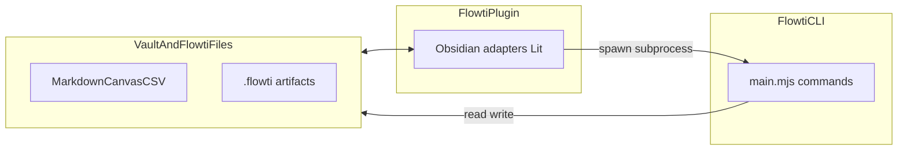

# Unified Architecture Design — Flowti Core

**Date:** 2026-03-18
**Status:** Draft
**Scope:** CLI + Plugin + Agent World convergence into hexagonal monorepo

---

## Vision

Flowti is one system with three presentation layers:

- **Flowti Core** — the brain. Command-driven, manages agents, projects, world state, pipelines. Pure TypeScript, zero platform dependencies.
- **Flowti CLI** — **command-only, non-interactive** terminal surface: subcommands, flags, predictable stdout/stderr, stable exit codes. Intended for CI, scripts, and **subprocess invocation from the Plugin** (e.g. `.flowti/bin/main.mjs`). Provides Node.js adapters (filesystem, shell, process spawning, LLM providers). Discoverability lives in **`help`**, generated command-surface docs (e.g. `docs:cli-surface` → `docs/cli-command-surface.md`), not a terminal UI framework.
- **Flowti Plugin** — Obsidian interface. Provides vault adapters, Lit web components, and Obsidian-native features (sessions, data exchange, analytics, canvas, journeys). Consumes shared core types/logic where applicable; **rich UX** (navigation, notifications, editing) lives here—not in the CLI.
- **Agent World** — 2D RPG visualization of the environment via ExcaliburJS. Agents as characters, project state as world.

Input is vault-native: users express intent through markdown, canvas, frontmatter, CSV, JSON, YAML. The system reads and reacts. Project management is executed by agents, driven by user input.

The CLI ships as a standalone bundle under `.flowti/bin/` and may be distributed alongside the Plugin; day-to-day integration favors **vault files, `.flowti/` artifacts, and CLI subprocesses** rather than a second full-screen HTTP “project API” inside the plugin.

### Vault, Plugin, and CLI (today)



Optional future **remote control plane** (HTTP/SSE, WebSocket, or in-process `IEventTransport` between Plugin and core) should appear as a **narrow adapter** behind ports—not as a replacement for vault-native authority.

---

## Package Structure

```
C:\Projects\flowti\
├── 01 - Projects/
│   ├── Flowti Core/                   ← @flowti/core — shared domain layer
│   │   ├── src/
│   │   │   ├── domains/               ← pure domain logic
│   │   │   │   ├── agents/            ← agent types, store, world state
│   │   │   │   ├── world-state/       ← ECS state manager, entity CRUD
│   │   │   │   ├── events/            ← CoreEventMap, typed event system
│   │   │   │   ├── config/            ← ProjectConfig schema, loading logic
│   │   │   │   ├── project/           ← project detection, summary
│   │   │   │   └── ...               ← domains migrate here over time
│   │   │   ├── engines/               ← command, store, pipeline engines
│   │   │   ├── ports/                 ← IFileSystem, IShell, IClock, IEventTransport
│   │   │   └── index.ts              ← public API barrel
│   │   ├── tests/
│   │   ├── configs/
│   │   │   ├── flowti.config.json
│   │   │   ├── tsconfig.json
│   │   │   ├── vitest.config.ts
│   │   │   └── eslint.config.mjs
│   │   └── package.json              ← "name": "@flowti/core", zero deps
│   ├── Flowti CLI/                    ← imports @flowti/core, Node adapters
│   └── Flowti Plugin/                 ← imports @flowti/core, Obsidian adapters
└── package.json                       ← workspaces: ["01 - Projects/*"]
```

Three sibling projects under `01 - Projects/`, all CLI-managed with their own `configs/flowti.config.json`. Core is a workspace dependency consumed by both CLI and Plugin.

### Workspace Bootstrap

The vault root gets a `package.json` with npm workspaces. Practical considerations:

- **`node_modules/` at vault root** — add to `.gitignore` and `.obsidianignore` to prevent Obsidian indexing
- **Directory names with spaces** — `"01 - Projects/Flowti Core"` works with npm workspaces when quoted. Minimum npm version: 9+ (ships with Node 18+). Validated against the existing space-containing project paths.
- **Workspace references** — consumers use `"@flowti/core": "workspace:*"` in `package.json`. Core is never published to npm. Version management is a non-concern.

### ESLint Architecture Enforcement

Core gets its own `configs/eslint.config.mjs` with strict rules:
- Ban all `node:*` imports (no `node:fs`, `node:path`, `node:child_process`)
- Ban `obsidian` imports
- Ban any direct platform API (`process`, `window`, `document`, `require`)
- Port interfaces (`ports/`) are importable by everything in core — they are pure interface definitions
- Domains receive engine capabilities via dependency injection (`CoreDeps`), not direct import
- Engines may import ports (to type their dependencies)

---

## Port Interfaces

Core defines capability interfaces. Adapters implement them per platform.

### IFileSystem

```typescript
interface IFileSystem {
  readFile(path: string): Promise<string>
  writeFile(path: string, content: string): Promise<void>
  exists(path: string): Promise<boolean>
  mkdir(path: string, opts?: { recursive?: boolean }): Promise<void>
  readdir(path: string): Promise<string[]>
  readdirWithTypes(path: string): Promise<DirEntry[]>  // { name, isDirectory, isFile }
  copyFile(src: string, dest: string): Promise<void>
  remove(path: string, opts?: { recursive?: boolean }): Promise<void>  // covers both files and dirs
  stat(path: string): Promise<FileStat>
}
```

Note: `remove` with `{ recursive: true }` covers both `unlinkSync` (files) and `rmSync` (directory trees). `readdirWithTypes` avoids N+1 `stat()` calls in directory scanning — critical for store engines and project detection.

- CLI adapter: wraps `node:fs/promises`
- Plugin adapter: wraps Obsidian `vault.adapter` + `vault.read`/`vault.modify`

Note: CLI's current `IFileSystem` is synchronous. Core goes fully async because Obsidian's vault API is async. CLI adapter wraps sync calls in promises.

### IShell

```typescript
// Core defines the minimal shell interface that core domains need
interface IShell {
  run(cmd: string, opts?: ShellOpts): Promise<ShellResult>
  spawn(cmd: string, opts?: SpawnOpts): IChildProcess  // named to avoid collision with CLI's IProcess (current process env)
}
```

- Core's `IShell` is intentionally minimal — only `run()` and `spawn()`. Most shell usage stays in CLI controllers/infrastructure (builds, tests, e2e), not in core domains.
- CLI extends this with its own richer `ICliShell extends IShell` (adding `runSilent`, `runCapture`, `runCaptureDetailed`, `spawnBackground`, `runAsync`, `runParallel`). These remain CLI-only.
- Plugin: does not expose `IShell` to core as a general-purpose port. **Project and tooling flows** use Obsidian/vault I/O plus **local `child_process` spawns** (shell, Node, Flowti CLI under `.flowti/bin`) — not an in-plugin HTTP project server. Optional future transports may forward `command.request`-style work to a CLI or core instance; that remains adapter-specific.

### IEventTransport

```typescript
interface IEventTransport {
  emit<K extends keyof CoreEventMap>(type: K, payload: CoreEventMap[K]): Promise<void>
  subscribe<K extends keyof CoreEventMap>(type: K, handler: (payload: CoreEventMap[K]) => void | Promise<void>): Unsubscribe
  subscribeAll(handler: (type: string, payload: unknown) => void | Promise<void>): Unsubscribe
}
```

Note: `emit` returns `Promise<void>` to accommodate async handlers (Plugin's existing EventBus is async). The CLI's direct transport can resolve immediately if all handlers are sync, but the interface must not prevent async subscribers.

Possible implementations include in-process direct calls, HTTP/SSE, or WebSocket (see **Transport implementations** below). **Shipping priority** follows whatever integration is actually used: today, vault + CLI subprocess; optional wire transports when a real consumer needs them.

### Utility Ports

```typescript
// Matches CLI's existing IClock — proven interface, no reason to simplify
interface IClock {
  now(): Date
  ms(): number
  iso(): string
  safeIso(): string
}

// Full path interface — CLI's existing 8-method IPaths, all used across codebase
interface IPaths {
  join(...parts: string[]): string
  resolve(...parts: string[]): string
  dirname(p: string): string
  basename(p: string, ext?: string): string
  relative(from: string, to: string): string
  extname(p: string): string
  isAbsolute(p: string): boolean
  sep: string
}
```

Note: `IStorage` (key-value) is intentionally omitted. No core domain needs it yet. Add when a concrete consumer exists — per anti-pattern #5.

### CoreDeps

```typescript
interface CoreDeps {
  disk: IFileSystem             // named "disk" to match CLI convention — avoids renaming 400+ refs
  clock: IClock
  paths: IPaths
  transport: IEventTransport
  shell?: IShell                // optional — only CLI provides this
}
```

CLI extends with `CliDeps extends CoreDeps` — adds **`proc`** (current process / env), **logging**, **event bus**, optional **`agentShell`** / **LLM provider registry**, and **`IInput`** only where legacy or exceptional stdin prompts still exist. **New commands must not depend on interactive stdin**; prefer flags, env vars, and vault files. Plugin extends with `PluginDeps extends CoreDeps` (adds Obsidian app, EventBus bridge, Lit rendering context). The `disk` naming matches the CLI's existing convention — no mass rename needed. ISP subsets (`Pick<CoreDeps, ...>`) continue the existing pattern.

---

## Event Transport — Communication Backbone

### CoreEventMap

The canonical typed event map, composed from domain-specific sub-maps (same proven pattern as both CLI's `CliEventMap` and Plugin's `FlowtiEventMap`). Each domain registers its own events; `CoreEventMap` is the intersection:

```typescript
// Structured error type for cross-transport error propagation
interface CoreError {
  code: string          // machine-readable: "AGENT_NOT_FOUND", "COMMAND_FAILED"
  message: string       // human-readable description
  details?: unknown     // optional structured data
}

// Domain-specific event maps (each lives alongside its domain)
interface AgentEventMap {
  'agent.action':          { agent: string; action: AgentActionType; detail?: string }
  'agent.state.changed':   { agent: string; from: WorkerState; to: WorkerState }
  'agent.message':         { agent: string; role: 'user' | 'agent'; content: string }
  'agent.task.assigned':   { agent: string; task: string; brief?: string }
  'agent.task.completed':  { agent: string; task: string; result: string }
}

interface WorldEventMap {
  'world.entity.updated':  { id: string; components: Record<string, unknown> }
  'world.state.snapshot':  WorldState
}

interface ProjectEventMap {
  'project.build.started':   { project: string }
  'project.build.completed': { project: string; success: boolean }
  'project.test.result':     { project: string; passed: number; failed: number }
}

interface CommandEventMap {
  'command.request':   { id: string; command: string; args: Record<string, unknown> }
  'command.response':  { id: string; success: boolean; data?: unknown; error?: CoreError }
}

// Composed — grows as domains migrate to core
interface CoreEventMap extends
  AgentEventMap, WorldEventMap, ProjectEventMap, CommandEventMap {}
```

Vault and UI events are Platform-specific — they live in `PluginEventMap`, not core:

```typescript
// Plugin-only event maps (defined in Plugin, not in core)
interface VaultEventMap {
  'vault.file.active':  { path: string; content?: string }
  'vault.file.changed': { path: string }
  'vault.selection':    { path: string; text: string }
}

interface UiEventMap {
  'ui.navigate':  { view: string; params?: Record<string, unknown> }
  'ui.notify':    { message: string; level: 'info' | 'warn' | 'error' }
  'ui.file.open': { path: string; line?: number }
}

// Plugin composes core + its own events
interface PluginEventMap extends CoreEventMap, VaultEventMap, UiEventMap {}
```

As domains migrate from Plugin to core (Wave 4), their event maps get added to `CoreEventMap`. Plugin extends `CoreEventMap` with `PluginEventMap` for Obsidian-specific events that never touch core. The `IEventTransport` generic can be parameterized per consumer: `IEventTransport<CoreEventMap>` in core, `IEventTransport<PluginEventMap>` in Plugin.

### Transport Implementations

| Transport | When used | How it works |
|-----------|-----------|-------------|
| **Vault + subprocess CLI (default today)** | Plugin drives tooling and automation | Plugin reads/writes the vault and `.flowti/` via Obsidian adapters; runs **`main.mjs`** (and other local processes) with structured args. No requirement for an in-plugin HTTP server. |
| **Direct (in-process)** | Future: Plugin and core share one runtime | In-process `IEventTransport` (function calls). Useful when `@flowti/core` runs inside the Plugin bundle and domains are wired without a wire protocol. |
| **HTTP/SSE** | Optional remote control plane | Same `command.request` / `command.response` pattern over HTTP/SSE if a separate CLI or service process is the integration point. |
| **WebSocket** | Agent World in browser | Future. Same event map, different wire protocol. |

### Bidirectional Commands

The `command.request`/`command.response` pattern enables either side to invoke actions on the other:

- Plugin sends `{ command: "agent.assign-task", args: { agent: "Architect", task: "Review PR" } }` → Core processes → responds with result
- Core sends `{ command: "ui.open-file", args: { path: "docs/spec.md" } }` → Plugin opens it

Same pattern, both directions, through any transport.

---

## Domain Migration Strategy (Strangler Fig)

Both projects keep working throughout. One domain moves at a time. Old code is deleted only after the core version is proven. Each wave is a feature branch that can be reverted by reverting the merge — the strangler fig pattern inherently supports rollback because old code is not deleted until new code is proven.

### Sync-to-Async Migration

The CLI's current `IFileSystem` is fully synchronous (332 sync FS usages across 133 source files). Core's `IFileSystem` is async. This is the largest migration cost.

**Strategy: deferred store engine migration.**

- Wave 1 extracts port *interfaces* and config *types* only — no runtime behavior moves yet
- The store engine stays in CLI during Wave 1. Core gets the `StoreDescriptor` type and `StoreApi` interface, but not `createStore()` implementation
- Wave 2 creates an async `createStore()` in core. CLI keeps its own sync `createStore()` implementation during transition (zero-deps constraint prohibits sync wrappers like `deasync`)
- By Wave 3, CLI controllers migrate to async one-by-one. Each controller that touches a store becomes async. This is incremental — not a big bang rewrite
- Target: all CLI store consumers are async by end of Wave 3. The sync wrappers are deleted.

### Wave 1 — Foundation

| Extract from CLI | Moves to core |
|-----------------|---------------|
| `src/infrastructure/types.ts` | Port interfaces: `IFileSystem`, `IShell`, `IClock`, `IPaths` (interfaces only) |
| `src/infrastructure/cli-events.ts` | `CoreEventMap`, `IEventTransport`, `CoreEvent<T>` |
| `src/infrastructure/types-config.ts` | `ProjectConfig`, `ManagementConfig`, `AgentsConfig`, all config types |
| `src/infrastructure/store-engine.ts` | `StoreDescriptor`, `StoreApi` types (interfaces only — implementation stays in CLI) |
| `src/infrastructure/deps.ts` | `CoreDeps` interface + ISP subsets |

**After wave 1:** Both projects import types from `@flowti/core`. No behavior change. CLI's `CliDeps extends CoreDeps`. Plugin starts wiring Obsidian adapters to core ports. Store engine implementation has not moved yet — only its type contract.

### Wave 2 — Agents + World State (highest pain, biggest payoff)

| Extract | What moves |
|---------|-----------|
| Agent types | `AgentDefinition`, `AgentSummary`, `AgentCard`, `WorldEntity`, `WorldState`, `WorkerState`, `AgentAction` — one canonical set |
| World state manager | Pure state logic (entity CRUD, action log, listeners). File persistence stays in adapters. |
| Agent store | `createStore()` specialized for agent markdown files |
| Worker types | `IWorkerManager` interface, state machine, decision logic |

**After wave 2:** Plugin deletes its own `AgentCard`, `ConversationTurn`, `IAgentService` types. `HttpAgentService.entityToCard()` mapping disappears — Plugin consumes the same `AgentCard` core produces. **Silent breakage problem is eliminated.**

### Wave 3 — Project + Pipeline + Command

| Extract | What moves |
|---------|-----------|
| Project domain | Config loading, project detection, `ProjectSummary`, `ProjectDetail` |
| Pipeline engine | Generic linear/DAG pipeline runner |
| Command engine | `adaptDescriptor()` — declarative command definitions |

**After wave 3:** Plugin's vault-backed project service (e.g. `IProjectService` / `VaultProjectService`) simplifies — fewer duplicated types and more shared command/project logic from core, whether invoked in-process or via CLI subprocess.

### Wave 4 — Plugin Domains Migrate Inward (long tail)

Each follows the pattern: move pure domain logic to core, leave platform I/O as adapter.

| Domain | Logic to core | Adapter stays in Plugin |
|--------|--------------|------------------------|
| Sessions | State machine, storage, lifecycle | Obsidian vault file sync, notes rendering |
| Analytics | Query engine, measurement logic | Obsidian-specific data sources |
| Data Exchange | CSV parsing, pipeline execution | Vault file adapters |
| Journeys | Step execution, journey model | Canvas rendering |
| Capture | Inbox logic, item model | Ribbon, command palette |
| Train | Session capture model | Obsidian workspace integration |

### What Stays in Each Project Permanently

| CLI only | Plugin only |
|----------|-------------|
| Node adapters (`node:fs`, `node:child_process`) | Obsidian adapters (vault API, metadata cache, workspace) |
| Command registry, dispatch, flag parsing, **non-interactive** stdout/stderr contract | Lit web components, CSS layers, views |
| **`help`, generated CLI surface documentation** (e.g. `docs:cli-surface`) | Obsidian plugin lifecycle (`onload`/`onunload`) |
| LLM provider infrastructure (Claude, Cursor, Ollama) | EventBridge (Obsidian events → core events) |
| Process pool, agent process spawning | Sitemap bootstrap, view registration |
| Optional HTTP/SSE server (**remote / future** control plane only) | Optional client/launcher for that remote mode (**if** shipped) |

---

## Bundling and Distribution

### Build Pipeline

```
@flowti/core       → tsc (type checking only, no standalone bundle)
Flowti CLI         → esbuild → .flowti/bin/main.mjs (tree-shakes core inline)
Flowti Plugin      → esbuild → .obsidian/plugins/flowti-ibde/main.js (tree-shakes core inline)
```

Core never produces its own bundle. It gets tree-shaken into each consumer by esbuild. Zero runtime deps promise maintained.

### Distribution Modes

**Obsidian + vault (primary today):**
Plugin uses Obsidian APIs for vault I/O and spawns **Flowti CLI** (and other tools) as subprocesses. Authority for project summaries, agent dashboards, and world artifacts remains **files under the vault and `.flowti/`**, unless a future adapter explicitly adds a network control plane.

**In-process core (optional / future):**
Plugin imports `@flowti/core` and runs selected domains inside Electron with a **direct** `IEventTransport`. Agent or worker processes may still use `node:child_process` where Electron allows it.

**Remote mode (optional / future):**
User runs a long-lived CLI or service (e.g. `flowti serve`). Plugin (or another client) connects via HTTP/SSE (or similar) using the same typed event/command patterns. Same conceptual model as today’s `command.request` / `command.response`, different wire.

**Standalone CLI (no Plugin):**
Ships as `.flowti/bin/main.mjs`. **Command-only**: subcommands and flags, stable exit codes, human-oriented stdout/stderr (and optional machine-readable output where commands define it). **Discoverability** via `help` and **generated command-surface documentation** (e.g. `flowti docs:cli-surface` → `docs/cli-command-surface.md`). **Subprocess contract** for callers (including the Plugin): document expected flags, stderr for errors, and exit codes for automation.

### Plugin Package Contents

```
.obsidian/plugins/flowti-ibde/
├── main.js          ← Plugin bundle (includes core, Obsidian entry)
├── manifest.json
├── styles.css
└── data.json        ← Obsidian plugin state
```

---

## Test Strategy

Domain tests move with their domains. Core has its own vitest config with the same coverage thresholds.

### Core tests

- Pure mock injection — no `vi.mock()` for infrastructure since core has no infrastructure
- Every port is a simple mock object passed via `CoreDeps`
- Coverage target: 80% statements, 80% lines (same as CLI)
- Test structure mirrors source: `src/domains/agents/foo.ts` → `tests/domains/agents/foo.test.ts`

### CLI tests after migration

- CLI tests that covered domain logic move to core alongside the domain
- CLI retains integration tests verifying adapter wiring: "does `NodeFileSystem` correctly implement `IFileSystem`?"
- Controller tests remain in CLI — they test flag parsing, project guards, and renderer wiring
- Existing `vi.mock()` patterns continue for CLI's own infrastructure

### Plugin tests after migration

- Plugin tests that tested duplicated domain logic (e.g., agent card mapping) are deleted — core tests cover it
- Plugin retains integration tests for Obsidian adapters and Lit component tests
- `StubAgentService` (and similar test doubles) evolve to stub **core ports / `IEventTransport`** or **vault + CLI fixtures** instead of ad hoc HTTP bridges

### Build ordering in CI

```
1. @flowti/core    → tsc + vitest (must pass before consumers)
2. Flowti CLI      → tsc + vitest (imports core)
3. Flowti Plugin   → tsc + vitest (imports core)
```

Steps 2 and 3 can run in parallel. Step 1 is a gate.

---

## Developer Experience

### Watch mode across packages

- Core: `tsc --watch` for type checking (no bundle needed)
- CLI: esbuild watch resolves `@flowti/core` via workspace symlink — picks up core changes automatically
- Plugin: esbuild watch does the same
- In practice: edit a core type → CLI and Plugin esbuild watchers detect the change via symlink → rebuild

### TypeScript project references

Use `tsconfig.json` `references` to enable incremental builds:

```json
// CLI configs/tsconfig.json (lives at 01 - Projects/Flowti CLI/configs/)
{ "references": [{ "path": "../../Flowti Core" }] }
```

This gives faster type-checking and ensures build ordering without external tooling.

### Git history preservation

File moves should use `git mv` where possible. Each wave's PR should be structured as:
1. First commit: file moves only (`git mv`)
2. Second commit: import path updates and modifications

This preserves `git log --follow` traceability for moved files.

---

## Known Risks

### 1. Embedded mode agent spawning in Electron

The spec assumes `node:child_process` is available in Obsidian's Electron runtime. This works today but:
- Obsidian may restrict Node.js APIs in future versions
- `child_process.spawn` in Electron needs the correct Node binary path

**Mitigation:** Validate embedded agent spawning as a Wave 2 acceptance criterion. If Obsidian restricts it, fall back to **CLI (or a small helper process) as a separate subprocess** — aligned with the subprocess-first integration model already used for vault tooling.

### 2. Plugin domains with third-party dependencies

Wave 4 migrates Plugin domains to core. Some use third-party libraries (e.g., `papaparse` for CSV, `zod` for validation). Core has a zero-deps constraint.

**Mitigation:** Domain logic that requires a third-party library either: (a) receives the library as an injected dependency via a port interface (e.g., `ICsvParser`), or (b) stays in Plugin. The zero-deps constraint applies to `package.json` — core can define port interfaces that adapters satisfy using any library.

### 3. npm workspace paths with spaces

`"01 - Projects/Flowti Core"` contains spaces. Most npm tooling handles this, but edge cases exist with certain esbuild resolve plugins and older npm versions.

**Mitigation:** Minimum npm 9+ (Node 18+). Test workspace linking early in Wave 1 bootstrap. If issues arise, `@flowti/core` can live at `packages/core/` as a fallback.

---

## Anti-Patterns to Avoid

### 1. No copy-paste types with "keep in sync" comments
Types live in `@flowti/core` or they don't exist. The current `ProjectSummary` duplication (CLI and Plugin defining it independently, already diverged on `StorybookStatus.pid`) is the exact problem this architecture solves.

### 2. No platform detection in core
No `if (typeof window !== 'undefined')` or `if (process.platform === 'win32')` inside core domains. Different behavior per platform goes through port interfaces. Core does not know what runtime it runs in.

### 3. No monkey-patching interfaces
The current `dashboard-service.ts` mutates `worldState.updateEntity` by reference to inject SSE broadcasting. In the new model, the transport subscribes to `world.entity.updated` events and forwards them. No patching.

### 4. Plugin never imports CLI directly
Plugin depends on `@flowti/core`. CLI depends on `@flowti/core`. Plugin never imports from CLI source. If Plugin needs something CLI has, it belongs in core.

### 5. Don't migrate unstable domains
If a domain is actively being designed (e.g., journey executor), leave it where it is. Extract only when the domain's API surface is settled. Premature extraction creates churn in core that ripples to both consumers.

### 6. Don't break standalone CLI
Every core domain must work with `IShell` being `undefined` when core runs inside Plugin without a shell port. Every core domain must work without Obsidian (CLI runs headless, command-only). Port interfaces enforce this naturally.

### 7. Don't build transport before domains
Start with wave 1 (shared types) and wave 2 (agents). Prefer the **integration path you actually ship** (vault + CLI subprocess today). Add HTTP/SSE, WebSocket, or in-process direct `IEventTransport` only when a concrete feature needs that adapter — infrastructure without a consumer is waste.

### 8. Don't add terminal UI frameworks for product UX
Rich interaction belongs in the **Plugin** (Obsidian/Lit), **Agent World**, and **vault content** — not Ink, Blessed, or similar in the CLI. The CLI stays a thin, scriptable, documented command surface.

---

## Success Criteria

- [ ] `@flowti/core` package exists with zero platform dependencies
- [ ] Both CLI and Plugin compile against shared types from core
- [ ] Agent types exist in one place — no duplicate `AgentCard`, `WorldEntity`, `ProjectSummary`
- [ ] CLI rename of an agent field causes a compile error in Plugin (not silent degradation)
- [ ] Plugin integrates via **vault + `.flowti/` + CLI subprocess** as the default story; optional **in-process core** or **remote HTTP/SSE** adapters are documented when shipped, not assumed
- [ ] CLI works standalone without Obsidian (**command-only**, no TUI / interactive mode in the product narrative)
- [ ] **Documented command surface** is generated or maintained in-repo (aligned with `docs:cli-surface` and `docs/cli-command-surface.md` as referenced from the CLI entrypoint)
- [ ] **Subprocess contract** is clear for automation: stable exit codes, errors on stderr, flags documented for Plugin and CI callers
- [ ] Any remaining **stdin / interactive** behavior is **exceptional, bounded, and documented**; new commands avoid prompts in favor of flags and files
- [ ] Core tests run without any platform adapter (pure mock injection)
- [ ] Each migration wave is independently shippable
