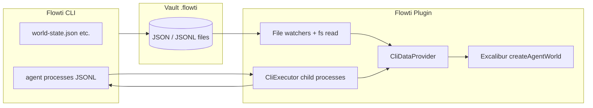

# Agent World architecture — Plugin + CLI + Excalibur

This document is the **source of truth** for how the **Agent World** runs inside the Flowti Obsidian plugin. It matches the implemented stack: **no in-game HTTP server**, **CLI-backed files and processes**, **ExcaliburJS** for the canvas experience.

## Principles

| Layer | Responsibility |
|--------|----------------|
| **Flowti CLI** | **Data authority**: writes and owns agent definitions, world state, task state, and agent runtime artifacts under `<vault>/.flowti/` (JSON / JSONL). Executes one-shot commands (`agent:list`, `agent:task`, …) and long-running `agent:start` sessions. |
| **Plugin (Obsidian)** | Hosts the view, reads vault files, spawns/bridges **Node child processes** for the bundled CLI (`node .flowti/bin/main.mjs …`), wires the in-plugin **EventBus** for UI and perf. **Does not** run a separate HTTP API for the game. |
| **ExcaliburJS (`src/game/`)** | **Presentation + local simulation**: scenes, actors, movement, particles, day cycle visuals, brain/talk/social **presentation**. It **displays** state from JSON and **reflects** CLI-driven updates; it does not replace the CLI as system of record. |

## Data flow (authoritative)

1. **CLI** (user or automation) updates `.flowti/var/world-state.json`, `.flowti/agents/data/agent-dashboard.json`, agent event logs, etc.
2. **Plugin** `CliDataProvider` **reads** those paths (and watches `world-state.json`) via Node `fs` in the Electron/Obsidian context.
3. **CliExecutor** talks to agents through **stdin/stdout JSONL** — same CLI binary as the vault; still **no** game-specific HTTP server.
4. **Excalibur** consumes `DataProvider` + `DashboardStore` and renders the world; **engine state persistence** (day clock, memory, …) may write back through `engine-state` to vault paths — **display-oriented** deltas, not a second source of agent truth.

## Key files

| Piece | Location |
|-------|-----------|
| Vault JSON provider + watchers | `src/game/config/cli-data-provider.ts` |
| `DataProvider` interface | `src/game/config/data-provider.ts` |
| Obsidian view entry | `src/ui/agents/agent-world-view.ts` |
| Engine factory | `src/game/engine.ts` |
| CLI child-process executor | `src/infrastructure/agents/cli-executor.ts` |
| Agent domain bootstrap | `src/bootstrap/agent-setup.ts` |

## What we explicitly do **not** rely on for the game

- No **REST/SSE dev server** as the primary path for roster or world state in production.
- No requirement that the **Flowti `serve`** command be running for the Agent World canvas to show data (roster/state come from files + optional CLI calls).

## Optional transports

The `DataProvider` interface is **transport-agnostic** so tests or future tools could inject mocks. **Production** Agent World uses **`createCliDataProvider`** only.

There is **no** `sendCommand("/api/...")` shim: tasks, permissions, and chat go through **`DashboardStore` + `ICliExecutor`**, not fake REST paths.

## Related docs

- `docs/agent-world-performance.md` — perf events for the Excalibur loop.
- `docs/Agent World - Game Design Document.md` — design intent (mechanics, UX).
