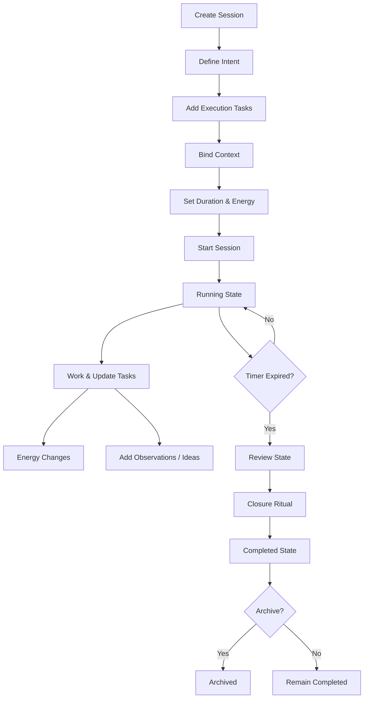
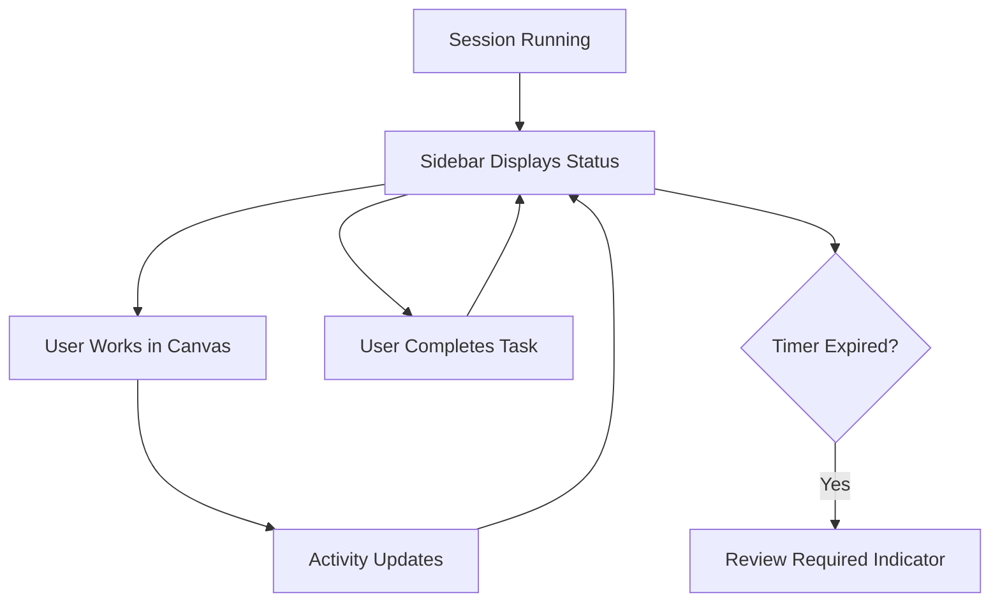

# 1. User Journey – Experience Level

## Persona A: Deep Work User

### Phase 1 — Preparation

User decides to focus on a specific outcome.

- Opens Flowti
    
- Creates new Session
    
- Defines Primary Outcome
    
- Adds 3–5 execution tasks
    
- Binds relevant PRD / Canvas / Notes
    
- Sets duration (e.g., 45 min)
    
- Sets energy level
    

**Emotional State:** Intentional, organized.

---

### Phase 2 — Execution

User starts session.

- Timer begins
    
- Session state → running
    
- User works in Canvas or Code
    
- Sidebar monitors progress
    
- User checks off tasks
    
- Energy may change
    
- Observations & Ideas captured
    

**Emotional State:** Focused, structured.

---

### Phase 3 — Overload Detection (Optional)

If:

- Too many tasks
    
- Too much context
    
- Energy drops
    

System shows Cognitive Load Warning.

User may:

- Remove tasks
    
- Split session
    
- Continue anyway
    

---

### Phase 4 — Completion

Timer ends → Session state → reviewing

Overlay appears:

- Outcome achieved? Yes / Partial / No
    
- Reflection questions
    
- Define next action
    

User completes ritual → session → completed

**Emotional State:** Closure, clarity.

---

### Phase 5 — Aftermath

User may:

- Convert to follow-up session
    
- Convert to backlog item
    
- Archive session
    

Session becomes traceable execution artifact.

---

# 2. Core User Flow – Deep Work Mode

---

## Flow A – Create & Run Session

```
User → Create Session
  → Define Intent
  → Add Execution Tasks
  → Bind Context
  → Set Duration
  → Set Energy
  → Click Start
  → Session State = running
```

---

## Flow B – During Session

```
Running
  → Work in main window
  → Toggle tasks complete
  → Add observations
  → Change energy
  → Context usage
  → Activity tracked
```

Optional:

```
If overloaded → Show warning
```

---

## Flow C – Timer Expiry

```
Timer reaches 0
  → State = reviewing
  → Review Overlay appears
  → User answers closure questions
  → Complete
  → State = completed
```

---

# 3. Sidebar Companion Flow

## Scenario: Working on Canvas

```
User opens Canvas in Main
User opens Session in Sidebar
```

Sidebar shows:

- Timer
    
- Energy
    
- Progress
    
- Context Snapshot
    
- Event Timeline
    

Flow:

```
User edits Canvas
  → Files modified counter increases
  → Event emitted
  → Sidebar timeline updates
  → User checks agenda item
```

When timer ends:

```
Sidebar indicates Review Required
User switches to Main
Review Overlay shown
```

---

# 4. Workshop Facilitation Flow

## Workshop Mode Variant

```
Create Session
  → Mode = Workshop
  → Execution tasks = Agenda items
  → Bind Canvas
  → Start session
  → Share screen
```

During workshop:

```
Facilitator:
  → Marks agenda item complete
  → Records decisions live
  → Adjusts energy (group energy proxy)
  → Uses timeline to show structure
```

Timer ends:

```
Review Ritual
  → Outcome achieved?
  → Decisions summary
  → Follow-up tasks generated
```

Session becomes workshop documentation artifact.

---

# 5. State-Based Flow Model

```
prepared
   ↓ Start
running
   ↓ Pause
paused
   ↓ Resume
running
   ↓ Timer Expiry
reviewing
   ↓ Complete Review
completed
   ↓ Archive
archived
```

Edge Case:

- User manually stops early → transition to reviewing
    

---

# 6. Failure / Edge Flows

### Edge Case 1 – User closes app mid-session

On reload:

```
If state = running
  → Restore session
  → Resume or mark as interrupted
```

---

### Edge Case 2 – User ignores review

System blocks:

```
No transition to completed without closure ritual
```

---

### Edge Case 3 – User starts session without outcome

System prevents:

```
Start disabled until Primary Outcome defined
```

---

# 7. Interaction Flow Diagram (Mermaid)

## Deep Work Flow



---

## Sidebar Monitoring Flow



---

# 8. Interaction Philosophy

The flow enforces:

1. Intent before execution
    
2. Measurable execution
    
3. Continuous awareness (energy + progress)
    
4. Mandatory reflection
    
5. Explicit closure
    

---

# 9. Strategic Outcome of This Flow

Sessions become:

- Execution artifacts
    
- Workshop documentation tools
    
- Measurable focus containers
    
- Event-emitting domain entities
    
