# Foreign Folder Watcher — Architecture & Dataflow

## Component Overview

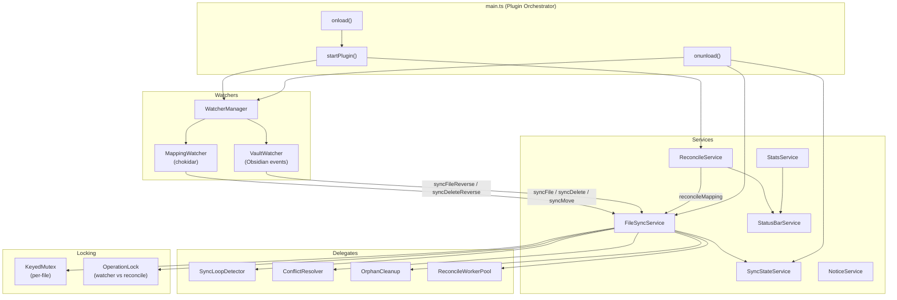
```mermaid
graph TB
    subgraph Plugin["main.ts (Plugin Orchestrator)"]
        Init["onload()"]
        Start["startPlugin()"]
        Shutdown["onunload()"]
    end

    subgraph Services
        FSS["FileSyncService"]
        RS["ReconcileService"]
        STS["StatsService"]
        SBS["StatusBarService"]
        SSS["SyncStateService"]
        NS["NoticeService"]
    end

    subgraph Delegates
        SLD["SyncLoopDetector"]
        CR["ConflictResolver"]
        OC["OrphanCleanup"]
        RWP["ReconcileWorkerPool"]
    end

    subgraph Watchers
        WM["WatcherManager"]
        MW["MappingWatcher\n(chokidar)"]
        VW["VaultWatcher\n(Obsidian events)"]
    end

    subgraph Locking
        KM["KeyedMutex\n(per-file)"]
        OL["OperationLock\n(watcher vs reconcile)"]
    end

    Init --> Start
    Start --> RS
    Start --> WM
    WM --> MW
    WM --> VW
    MW -->|syncFile / syncDelete / syncMove| FSS
    VW -->|syncFileReverse / syncDeleteReverse| FSS
    RS -->|reconcileMapping| FSS
    FSS --> SLD
    FSS --> CR
    FSS --> OC
    FSS --> RWP
    FSS --> KM
    FSS --> OL
    FSS --> SSS
    RS --> SBS
    STS --> SBS
    Shutdown --> WM
    Shutdown --> FSS
    Shutdown --> SSS
```

---

## Plugin Lifecycle

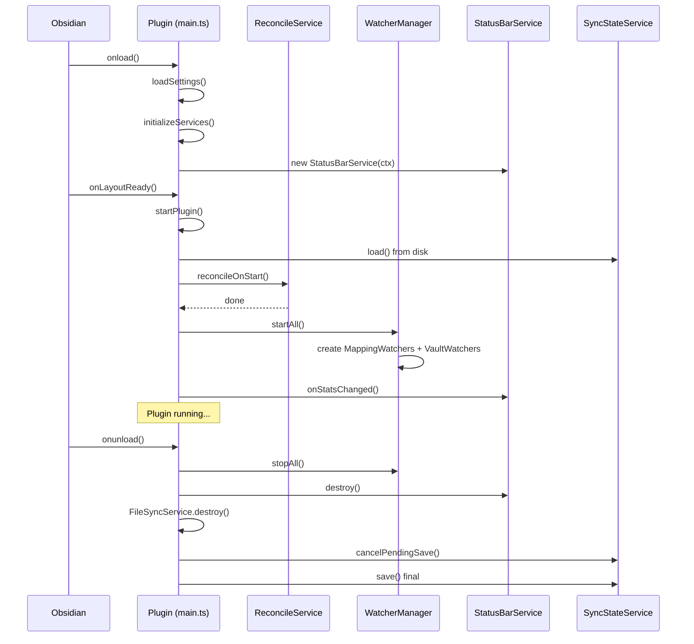
```mermaid
sequenceDiagram
    participant O as Obsidian
    participant P as Plugin (main.ts)
    participant RS as ReconcileService
    participant WM as WatcherManager
    participant SBS as StatusBarService
    participant SSS as SyncStateService

    O->>P: onload()
    P->>P: loadSettings()
    P->>P: initializeServices()
    P->>SBS: new StatusBarService(ctx)
    O->>P: onLayoutReady()
    P->>P: startPlugin()
    P->>SSS: load() from disk
    P->>RS: reconcileOnStart()
    RS-->>P: done
    P->>WM: startAll()
    WM->>WM: create MappingWatchers + VaultWatchers
    P->>SBS: onStatsChanged()

    Note over P: Plugin running...

    O->>P: onunload()
    P->>WM: stopAll()
    P->>SBS: destroy()
    P->>P: FileSyncService.destroy()
    P->>SSS: cancelPendingSave()
    P->>SSS: save() final
```

---

## WatcherManager Startup

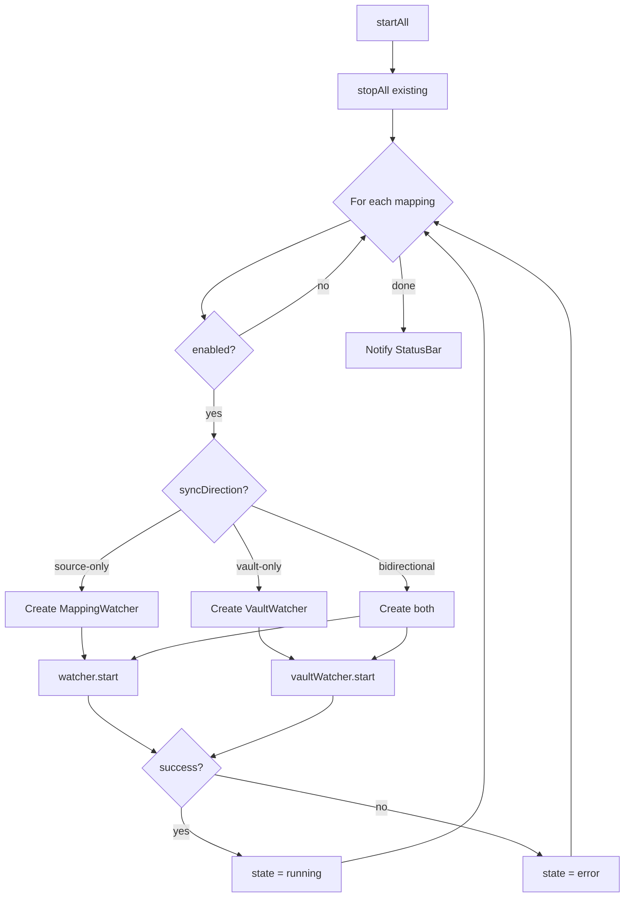
```mermaid
flowchart TD
    A[startAll] --> B[stopAll existing]
    B --> C{For each mapping}
    C --> D{enabled?}
    D -- no --> C
    D -- yes --> E{syncDirection?}
    E -- source-only --> F[Create MappingWatcher]
    E -- vault-only --> G[Create VaultWatcher]
    E -- bidirectional --> H[Create both]
    F --> I[watcher.start]
    G --> J[vaultWatcher.start]
    H --> I
    H --> J
    I --> K{success?}
    J --> K
    K -- yes --> L[state = running]
    K -- no --> M[state = error]
    L --> C
    M --> C
    C -- done --> N[Notify StatusBar]
```

---

## Forward Sync — Source → Vault

External file changes detected by chokidar flow through MappingWatcher into FileSyncService.

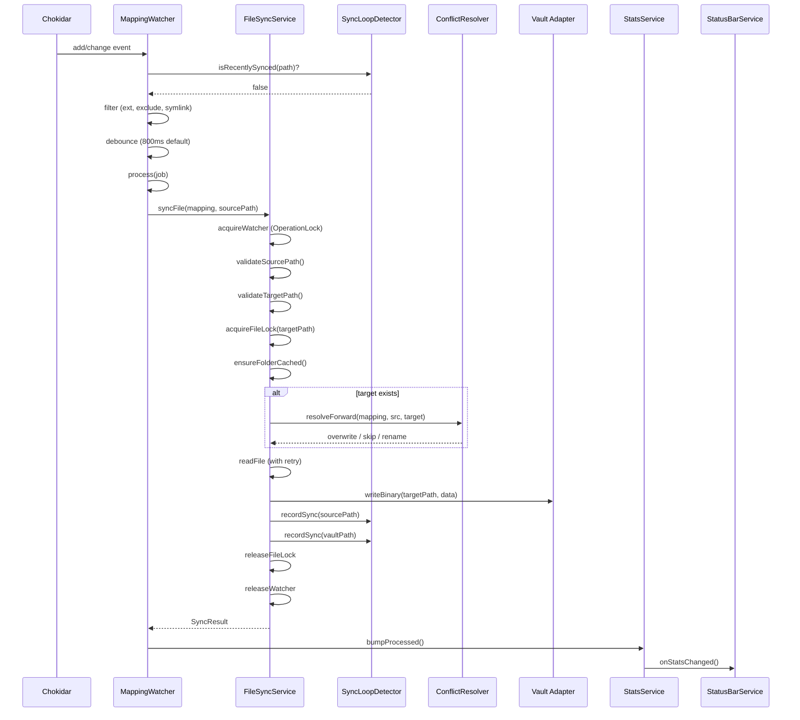
```mermaid
sequenceDiagram
    participant CK as Chokidar
    participant MW as MappingWatcher
    participant FSS as FileSyncService
    participant SLD as SyncLoopDetector
    participant CR as ConflictResolver
    participant VA as Vault Adapter
    participant Stats as StatsService
    participant SBS as StatusBarService

    CK->>MW: add/change event
    MW->>SLD: isRecentlySynced(path)?
    SLD-->>MW: false
    MW->>MW: filter (ext, exclude, symlink)
    MW->>MW: debounce (800ms default)
    MW->>MW: process(job)
    MW->>FSS: syncFile(mapping, sourcePath)

    FSS->>FSS: acquireWatcher (OperationLock)
    FSS->>FSS: validateSourcePath()
    FSS->>FSS: validateTargetPath()
    FSS->>FSS: acquireFileLock(targetPath)
    FSS->>FSS: ensureFolderCached()

    alt target exists
        FSS->>CR: resolveForward(mapping, src, target)
        CR-->>FSS: overwrite / skip / rename
    end

    FSS->>FSS: readFile (with retry)
    FSS->>VA: writeBinary(targetPath, data)
    FSS->>SLD: recordSync(sourcePath)
    FSS->>SLD: recordSync(vaultPath)
    FSS->>FSS: releaseFileLock
    FSS->>FSS: releaseWatcher
    FSS-->>MW: SyncResult

    MW->>Stats: bumpProcessed()
    Stats->>SBS: onStatsChanged()
```

### MappingWatcher Event Pipeline

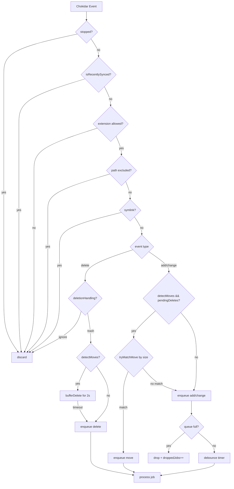
```mermaid
flowchart TD
    A[Chokidar Event] --> B{stopped?}
    B -- yes --> Z[discard]
    B -- no --> C{isRecentlySynced?}
    C -- yes --> Z
    C -- no --> D{extension allowed?}
    D -- no --> Z
    D -- yes --> E{path excluded?}
    E -- yes --> Z
    E -- no --> F{symlink?}
    F -- yes --> Z
    F -- no --> G{event type}

    G -- delete --> H{deletionHandling?}
    H -- ignore --> Z
    H -- trash --> I{detectMoves?}
    I -- yes --> J[bufferDelete for 2s]
    I -- no --> K[enqueue delete]

    G -- add/change --> L{detectMoves && pendingDeletes?}
    L -- yes --> M{tryMatchMove by size}
    M -- match --> N[enqueue move]
    M -- no match --> O[enqueue add/change]
    L -- no --> O

    O --> P{queue full?}
    P -- yes --> Q[drop + droppedJobs++]
    P -- no --> R[debounce timer]
    R --> S[process job]

    K --> S
    N --> S
    J -- timeout --> K
```

---

## Reverse Sync — Vault → Source

Vault changes detected by Obsidian events flow through VaultWatcher back to external files.

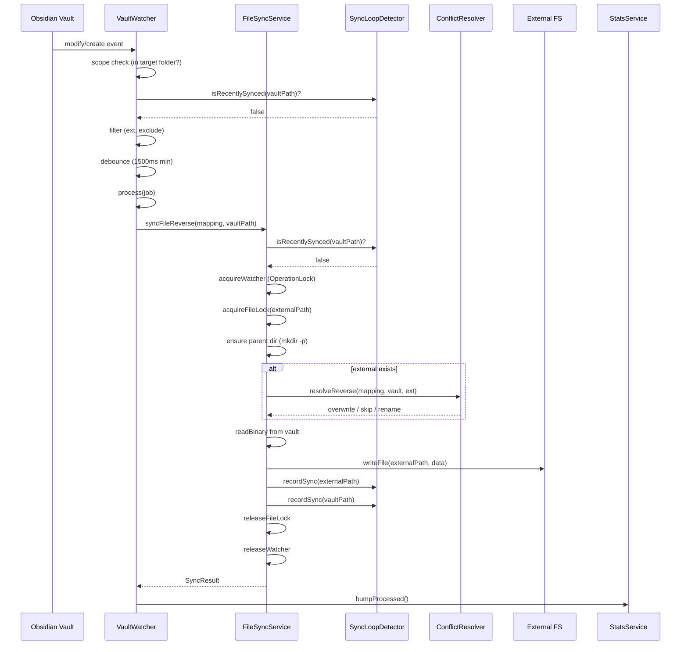
```mermaid
sequenceDiagram
    participant OV as Obsidian Vault
    participant VW as VaultWatcher
    participant FSS as FileSyncService
    participant SLD as SyncLoopDetector
    participant CR as ConflictResolver
    participant FS as External FS
    participant Stats as StatsService

    OV->>VW: modify/create event
    VW->>VW: scope check (in target folder?)
    VW->>SLD: isRecentlySynced(vaultPath)?
    SLD-->>VW: false
    VW->>VW: filter (ext, exclude)
    VW->>VW: debounce (1500ms min)
    VW->>VW: process(job)
    VW->>FSS: syncFileReverse(mapping, vaultPath)

    FSS->>SLD: isRecentlySynced(vaultPath)?
    SLD-->>FSS: false
    FSS->>FSS: acquireWatcher (OperationLock)
    FSS->>FSS: acquireFileLock(externalPath)
    FSS->>FSS: ensure parent dir (mkdir -p)

    alt external exists
        FSS->>CR: resolveReverse(mapping, vault, ext)
        CR-->>FSS: overwrite / skip / rename
    end

    FSS->>FSS: readBinary from vault
    FSS->>FS: writeFile(externalPath, data)
    FSS->>SLD: recordSync(externalPath)
    FSS->>SLD: recordSync(vaultPath)
    FSS->>FSS: releaseFileLock
    FSS->>FSS: releaseWatcher
    FSS-->>VW: SyncResult

    VW->>Stats: bumpProcessed()
```

---

## Reconciliation Flow

Bulk sync across all enabled mappings, run at startup or on demand.

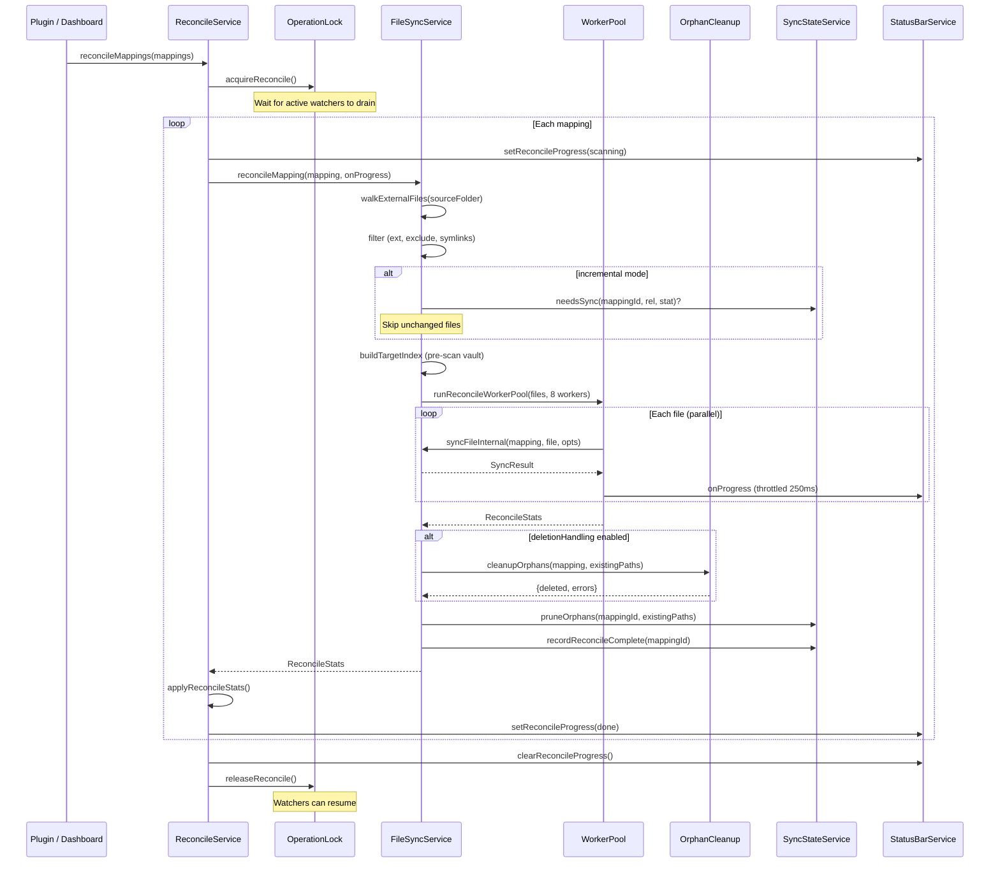
```mermaid
sequenceDiagram
    participant P as Plugin / Dashboard
    participant RS as ReconcileService
    participant OL as OperationLock
    participant FSS as FileSyncService
    participant RWP as WorkerPool
    participant OC as OrphanCleanup
    participant SSS as SyncStateService
    participant SBS as StatusBarService

    P->>RS: reconcileMappings(mappings)
    RS->>OL: acquireReconcile()
    Note over OL: Wait for active watchers to drain

    loop Each mapping
        RS->>SBS: setReconcileProgress(scanning)
        RS->>FSS: reconcileMapping(mapping, onProgress)

        FSS->>FSS: walkExternalFiles(sourceFolder)
        FSS->>FSS: filter (ext, exclude, symlinks)

        alt incremental mode
            FSS->>SSS: needsSync(mappingId, rel, stat)?
            Note over FSS: Skip unchanged files
        end

        FSS->>FSS: buildTargetIndex (pre-scan vault)
        FSS->>RWP: runReconcileWorkerPool(files, 8 workers)

        loop Each file (parallel)
            RWP->>FSS: syncFileInternal(mapping, file, opts)
            FSS-->>RWP: SyncResult
            RWP->>SBS: onProgress (throttled 250ms)
        end

        RWP-->>FSS: ReconcileStats

        alt deletionHandling enabled
            FSS->>OC: cleanupOrphans(mapping, existingPaths)
            OC-->>FSS: {deleted, errors}
        end

        FSS->>SSS: pruneOrphans(mappingId, existingPaths)
        FSS->>SSS: recordReconcileComplete(mappingId)
        FSS-->>RS: ReconcileStats

        RS->>RS: applyReconcileStats()
        RS->>SBS: setReconcileProgress(done)
    end

    RS->>SBS: clearReconcileProgress()
    RS->>OL: releaseReconcile()
    Note over OL: Watchers can resume
```

### Reconcile Worker Pool

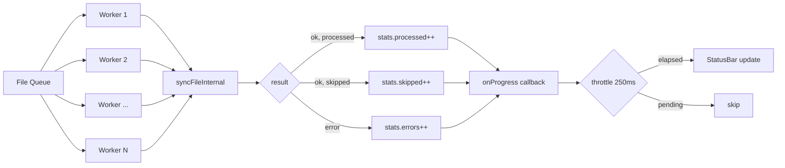
```mermaid
flowchart LR
    Q[File Queue] --> W1[Worker 1]
    Q --> W2[Worker 2]
    Q --> W3[Worker ...]
    Q --> WN[Worker N]

    W1 --> S[syncFileInternal]
    W2 --> S
    W3 --> S
    WN --> S

    S --> R{result}
    R -- ok, processed --> P[stats.processed++]
    R -- ok, skipped --> K[stats.skipped++]
    R -- error --> E[stats.errors++]

    P --> CB[onProgress callback]
    K --> CB
    E --> CB

    CB --> T{throttle 250ms}
    T -- elapsed --> UI[StatusBar update]
    T -- pending --> SKIP[skip]
```

---

## Loop Prevention

Bidirectional sync requires careful loop prevention. Without it, a forward sync triggers a vault event, which triggers a reverse sync, which triggers a chokidar event, ad infinitum.

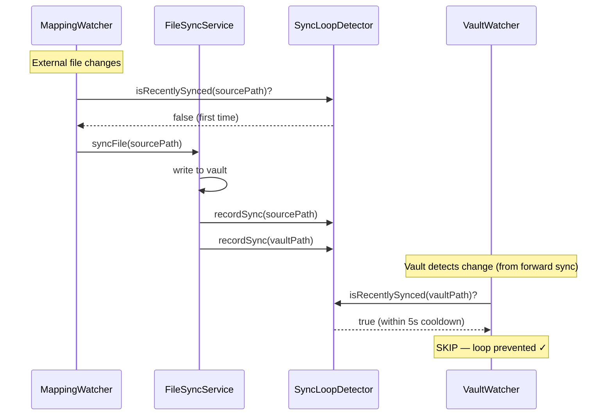
```mermaid
sequenceDiagram
    participant MW as MappingWatcher
    participant FSS as FileSyncService
    participant SLD as SyncLoopDetector
    participant VW as VaultWatcher

    Note over MW: External file changes

    MW->>SLD: isRecentlySynced(sourcePath)?
    SLD-->>MW: false (first time)
    MW->>FSS: syncFile(sourcePath)
    FSS->>FSS: write to vault
    FSS->>SLD: recordSync(sourcePath)
    FSS->>SLD: recordSync(vaultPath)

    Note over VW: Vault detects change (from forward sync)

    VW->>SLD: isRecentlySynced(vaultPath)?
    SLD-->>VW: true (within 5s cooldown)
    Note over VW: SKIP — loop prevented ✓
```

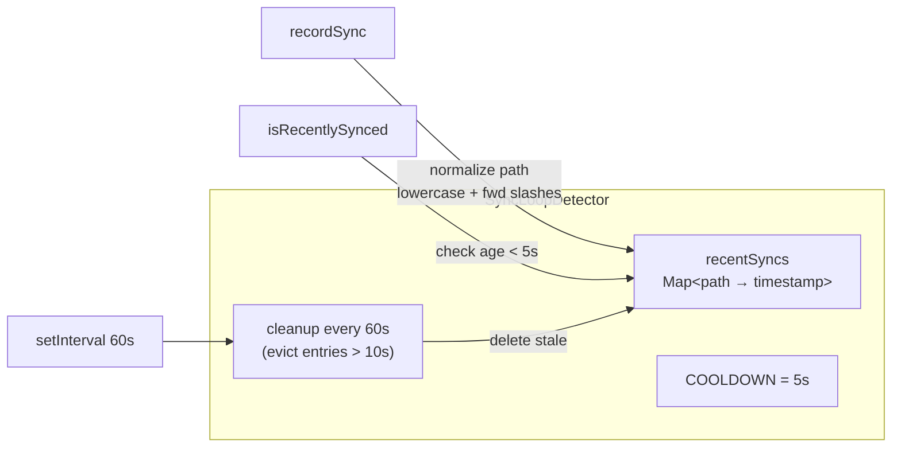
```mermaid
graph LR
    subgraph SyncLoopDetector
        MAP["recentSyncs\nMap&lt;path → timestamp&gt;"]
        CD["COOLDOWN = 5s"]
        CL["cleanup every 60s\n(evict entries > 10s)"]
    end

    REC[recordSync] -->|normalize path\nlowercase + fwd slashes| MAP
    CHK[isRecentlySynced] -->|check age < 5s| MAP
    TIMER[setInterval 60s] --> CL
    CL -->|delete stale| MAP
```

---

## Conflict Resolution

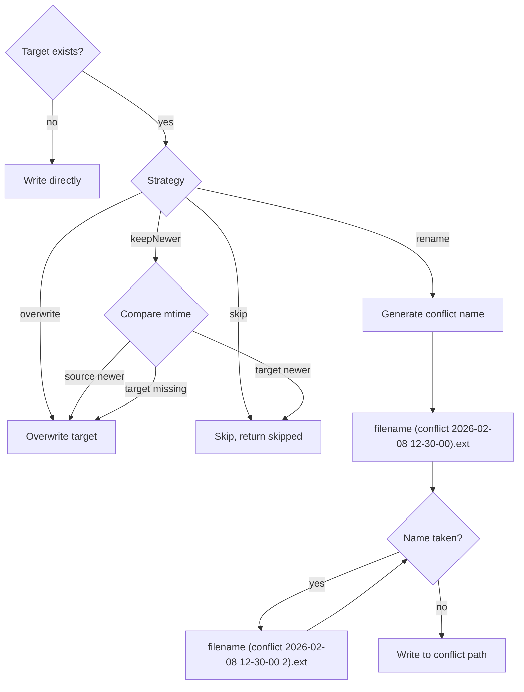
```mermaid
flowchart TD
    A{Target exists?} -- no --> B[Write directly]
    A -- yes --> C{Strategy}

    C -- overwrite --> D[Overwrite target]
    C -- skip --> E[Skip, return skipped]
    C -- keepNewer --> F{Compare mtime}
    C -- rename --> G[Generate conflict name]

    F -- source newer --> D
    F -- target newer --> E
    F -- target missing --> D

    G --> H["filename (conflict 2026-02-08 12-30-00).ext"]
    H --> I{Name taken?}
    I -- yes --> J["filename (conflict 2026-02-08 12-30-00 2).ext"]
    J --> I
    I -- no --> K[Write to conflict path]
```

**Reverse sync** uses `reverseConflictResolution` if set, otherwise falls back to `conflictResolution`.

---

## Concurrency Model

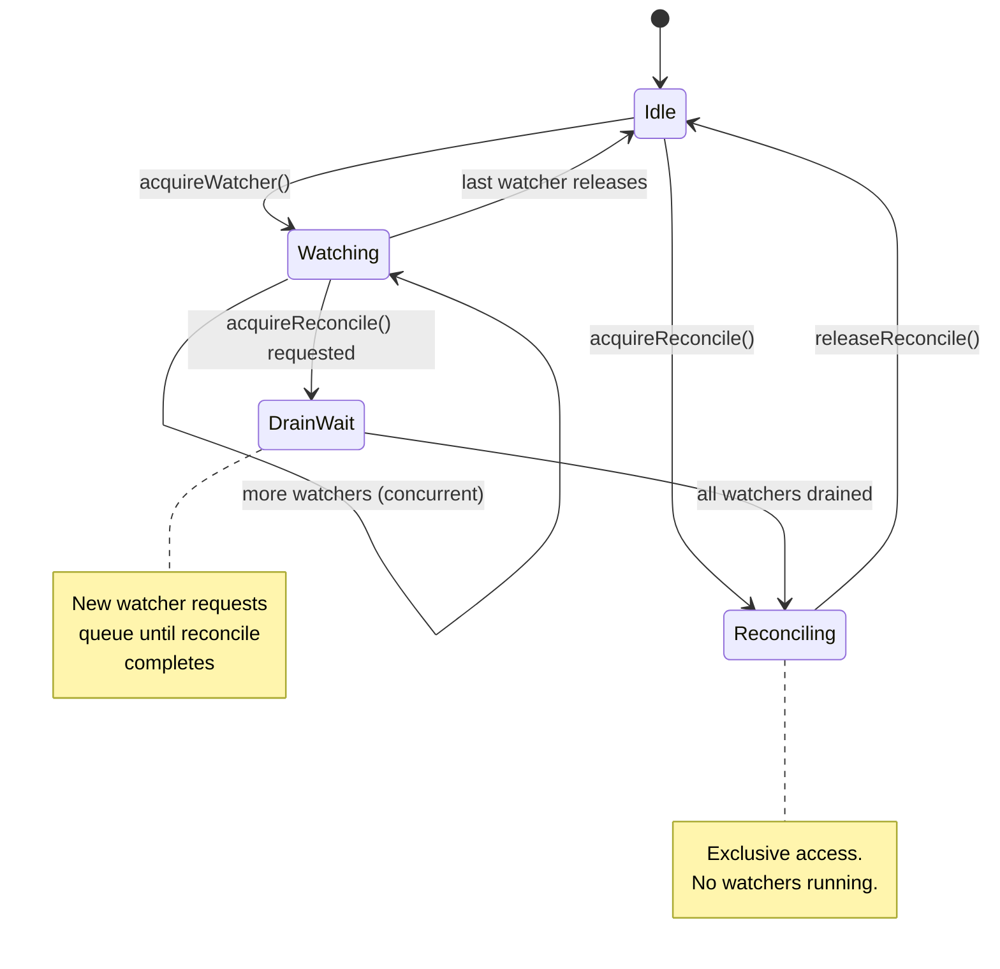
```mermaid
stateDiagram-v2
    [*] --> Idle

    Idle --> Watching : acquireWatcher()
    Watching --> Watching : more watchers (concurrent)
    Watching --> Idle : last watcher releases

    Idle --> Reconciling : acquireReconcile()
    Watching --> DrainWait : acquireReconcile() requested
    DrainWait --> Reconciling : all watchers drained
    Reconciling --> Idle : releaseReconcile()

    note right of DrainWait
        New watcher requests
        queue until reconcile
        completes
    end note

    note right of Reconciling
        Exclusive access.
        No watchers running.
    end note
```

### Per-File Locking (KeyedMutex)

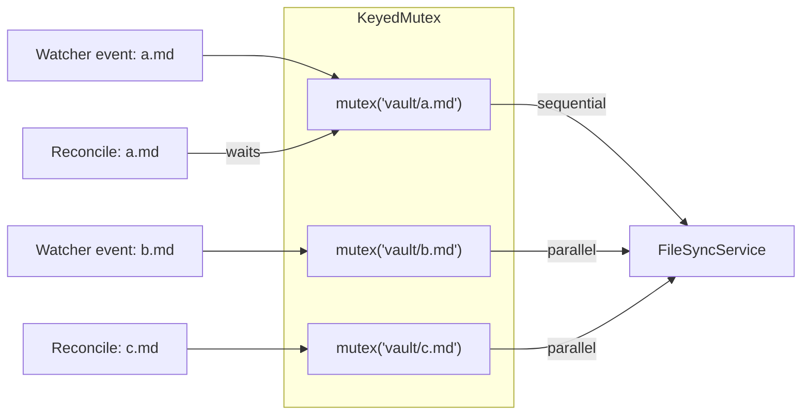
```mermaid
flowchart LR
    subgraph "KeyedMutex"
        M1["mutex('vault/a.md')"]
        M2["mutex('vault/b.md')"]
        M3["mutex('vault/c.md')"]
    end

    W1[Watcher event: a.md] --> M1
    W2[Watcher event: b.md] --> M2
    R1[Reconcile: a.md] -->|waits| M1
    R2[Reconcile: c.md] --> M3

    M1 -->|sequential| FS["FileSyncService"]
    M2 -->|parallel| FS
    M3 -->|parallel| FS
```

Multiple files sync in parallel, but writes to the **same** target file are serialized.

---

## Incremental Sync (SyncStateService)

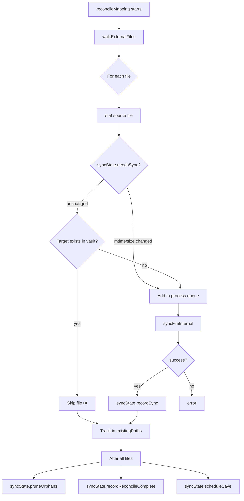
```mermaid
flowchart TD
    A[reconcileMapping starts] --> B[walkExternalFiles]
    B --> C{For each file}

    C --> D[stat source file]
    D --> E{syncState.needsSync?}

    E -- "mtime/size changed" --> F[Add to process queue]
    E -- "unchanged" --> G{Target exists in vault?}
    G -- yes --> H[Skip file ⏭️]
    G -- no --> F

    F --> I[syncFileInternal]
    I --> J{success?}
    J -- yes --> K[syncState.recordSync]
    J -- no --> L[error]

    H --> M[Track in existingPaths]
    K --> M

    M --> N[After all files]
    N --> O[syncState.pruneOrphans]
    N --> P[syncState.recordReconcileComplete]
    N --> Q[syncState.scheduleSave]
```

### State Persistence

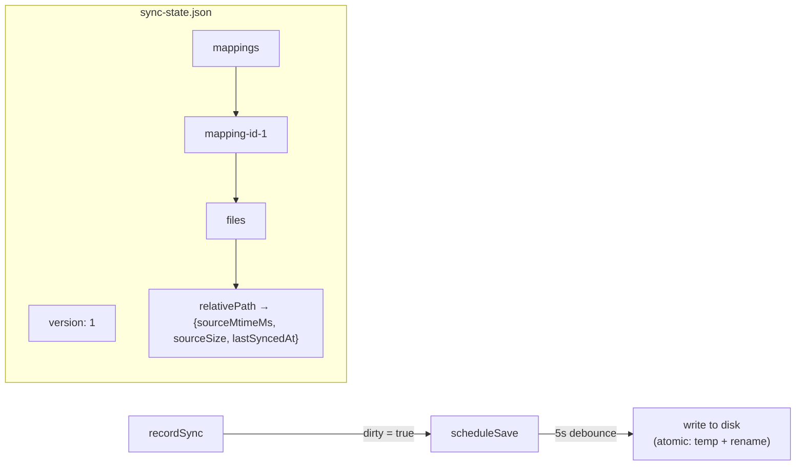
```mermaid
graph LR
    subgraph "sync-state.json"
        V["version: 1"]
        MA["mappings"]
        M1["mapping-id-1"]
        F1["files"]
        FE["relativePath → {sourceMtimeMs, sourceSize, lastSyncedAt}"]
    end

    MA --> M1
    M1 --> F1
    F1 --> FE

    WRITE[recordSync] -->|dirty = true| SAVE
    SAVE[scheduleSave] -->|5s debounce| DISK["write to disk\n(atomic: temp + rename)"]
```

---

## Move Detection

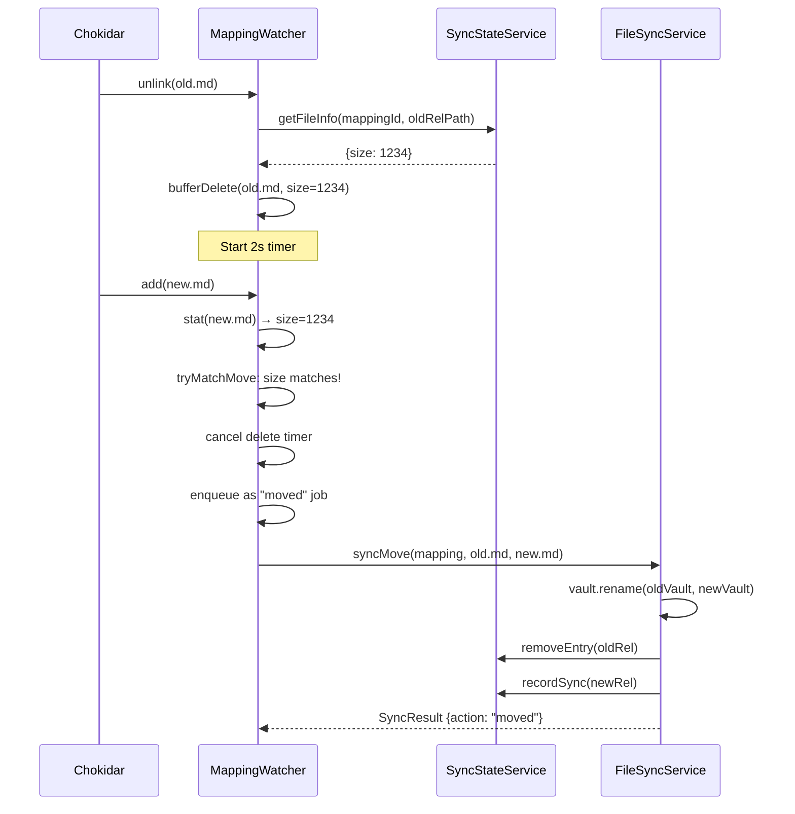
```mermaid
sequenceDiagram
    participant CK as Chokidar
    participant MW as MappingWatcher
    participant SSS as SyncStateService
    participant FSS as FileSyncService

    CK->>MW: unlink(old.md)
    MW->>SSS: getFileInfo(mappingId, oldRelPath)
    SSS-->>MW: {size: 1234}
    MW->>MW: bufferDelete(old.md, size=1234)
    Note over MW: Start 2s timer

    CK->>MW: add(new.md)
    MW->>MW: stat(new.md) → size=1234
    MW->>MW: tryMatchMove: size matches!
    MW->>MW: cancel delete timer
    MW->>MW: enqueue as "moved" job

    MW->>FSS: syncMove(mapping, old.md, new.md)
    FSS->>FSS: vault.rename(oldVault, newVault)
    FSS->>SSS: removeEntry(oldRel)
    FSS->>SSS: recordSync(newRel)
    FSS-->>MW: SyncResult {action: "moved"}
```

If the timer expires before a matching `add` arrives, the delete is processed normally.

---

## Status Bar Rendering

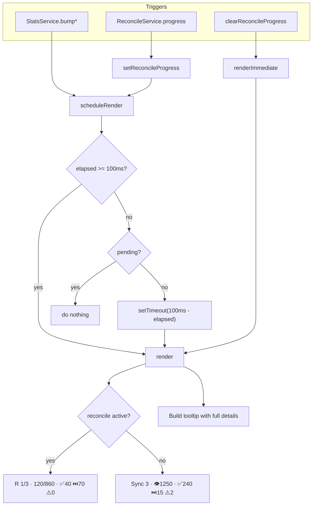
```mermaid
flowchart TD
    subgraph Triggers
        ST[StatsService.bump*]
        RP[ReconcileService.progress]
        CL[clearReconcileProgress]
    end

    ST --> SC[scheduleRender]
    RP --> SR[setReconcileProgress] --> SC
    CL --> RI[renderImmediate]

    SC --> T{elapsed >= 100ms?}
    T -- yes --> R[render]
    T -- no --> P{pending?}
    P -- yes --> NOOP[do nothing]
    P -- no --> TIMER["setTimeout(100ms - elapsed)"]
    TIMER --> R

    RI --> R

    R --> TEXT{reconcile active?}
    TEXT -- yes --> RC["R 1/3 · 120/860 · ✅40 ⏭️70 ⚠️0"]
    TEXT -- no --> NM["Sync 3 · 👁1250 · ✅240 ⏭️15 ⚠️2"]

    R --> TT[Build tooltip with full details]
```

---

## File Layout

```
src/
├── main.ts                          # Plugin orchestrator, wires everything
├── types.ts                         # Shared types (FolderMapping, SyncResult, etc.)
├── utils.ts                         # Shared utilities (path, filter, walk, validate)
│
├── services/
│   ├── FileSyncService.ts           # Core sync logic (forward, reverse, reconcile)
│   ├── ReconcileService.ts          # Orchestrates multi-mapping reconciliation
│   ├── ReconcileWorkerPool.ts       # Parallel file processing pool
│   ├── SyncLoopDetector.ts          # Bidirectional loop prevention
│   ├── ConflictResolver.ts          # Conflict resolution strategies
│   ├── OrphanCleanup.ts             # Vault orphan detection & removal
│   ├── SyncStateService.ts          # Incremental sync state persistence
│   ├── StatsService.ts              # Statistics tracking
│   ├── StatusBarService.ts          # Status bar UI (throttled rendering)
│   ├── LogService.ts                # Structured logging
│   ├── NoticeService.ts             # User notifications
│   ├── AsyncMutex.ts                # KeyedMutex + OperationLock
│   ├── retry.ts                     # Retry logic + PathTraversalError
│   └── types.ts                     # Service-level interfaces
│
├── watcher/
│   ├── WatcherManager.ts            # Watcher lifecycle management
│   ├── MappingWatcher.ts            # External → Vault (chokidar)
│   └── VaultWatcher.ts              # Vault → External (Obsidian events)
│
├── settings/
│   └── types.ts                     # FileWatcherSettings type
│
├── modals/
│   └── DashboardModal.ts            # Dashboard UI
│
└── interfaces/
    └── IPluginContext.ts             # Context interfaces for DI
```
