## Service Design Blueprint

### Scope

- focus: user interface (views, layouts, navigation)
    
- channels: Obsidian leaf views (catalog, subscriptions, editor, log, optional ingestion)
    
- principle: eventbus-first, stores as UI state source, views as containers
    
### Zielbild

- **Obsidian View**: nur Mount-Point + Lifecycle + minimal wiring
    
- **UI App Layer**: Layouts, Komponenten, Routing, State
    
- **Eventbus**: zentrale Kommunikation (Commands/Events), möglichst wenig direkte Service-Calls aus UI
	
- **Event Catalog:** The application documents itself by registering it's events, services, domains, commands and flows in the Event Catalog. The user documents its own domain automatically by using the application and it's features.
	
- **Domain Hubs:** The application is build around domains to provide easy to use interfaces supporting the user by his jobs to be done.

---

# View Descriptions

Dieser Abschnitt beschreibt jede View aus funktionaler Perspektive:  
Zweck, Zielgruppe, Layout, Kernfunktionen, Navigation und Eventbus-Verhalten.

|View|Layout|Primary Intent|
|---|---|---|
|Event Catalog|master_detail|Discovery & Documentation|
|Subscription Manager|three_pane|Management & Configuration|
|Subscription Editor|settings_form|Guided Setup|
|Event Log|log_console|Transparency & Debugging|
|Ingestion Monitor|three_pane|Operational Oversight|

---

## View: Event Catalog

**Route:** `/catalog`  
**Layout:** `master_detail`  
**Primary Persona:** System Builder, Knowledge Worker  
**Purpose:** Zentrale Übersicht aller Events und Einstieg in Event-Dokumentation.

### User Goals

- Events entdecken
    
- Event-Bedeutung verstehen
    
- Event-Dokumentation öffnen
    
- Subscription direkt aus Event erstellen
    

### Core Capabilities

- Domain-basierte Navigation
    
- Event-Suche und Filter
    
- Event-Detailansicht mit:
    
    - Beschreibung
        
    - Wann tritt das Event auf?
        
    - Warum ist es relevant?
        
    - Payload-Übersicht
        
    - Verwandte Events
        
    - Verlinkte Dokumentation
        

### Navigation Behavior

- Auswahl eines Events aktualisiert Detail-Panel
    
- Deep-Link via `?event={event_name}`
    
- „Subscribe“-Aktion navigiert zu `/subscriptions/new?event=...`
    

### Eventbus Interaction

**Emits Commands**

- `catalog.load`
    
- `catalog.select_event`
    
- `subscriptions.create_from_event`
    
- `docs.open`
    

**Consumes Events**

- `catalog.loaded`
    
- `catalog.selection_changed`
    
- `error.raised`
    

---

## View: Subscription Manager

**Route:** `/subscriptions`  
**Layout:** `three_pane`  
**Primary Persona:** System Builder  
**Purpose:** Verwaltung aller Event-Subscriptions.

### User Goals

- Subscriptions erstellen, bearbeiten, löschen
    
- Aktivieren/Deaktivieren
    
- Konfiguration prüfen
    
- Verknüpfte Events einsehen
    

### Core Capabilities

- Liste aller Subscriptions
    
- Status-Indikatoren (enabled/disabled)
    
- Detailansicht mit:
    
    - Event
        
    - Filter
        
    - Action-Konfiguration
        
    - Letzte Ausführung
        
- Inspector mit:
    
    - Validierungsstatus
        
    - Verlinkter Event-Dokumentation
        

### Navigation Behavior

- Auswahl einer Subscription lädt Detailansicht
    
- „Edit“ navigiert zu `/subscriptions/{id}/edit`
    
- „Create“ navigiert zu `/subscriptions/new`
    

### Eventbus Interaction

**Emits Commands**

- `subscriptions.load`
    
- `subscriptions.create`
    
- `subscriptions.update`
    
- `subscriptions.delete`
    
- `subscriptions.toggle_enabled`
    

**Consumes Events**

- `subscriptions.loaded`
    
- `subscription.created`
    
- `subscription.updated`
    
- `subscription.deleted`
    
- `subscription.validation_changed`
    
- `error.raised`
    

---

## View: Subscription Editor

**Route:**

- `/subscriptions/new`
    
- `/subscriptions/{id}/edit`
    

**Layout:** `settings_form`  
**Primary Persona:** System Builder  
**Purpose:** Guided Configuration einer Subscription.

### User Goals

- Event auswählen
    
- Filter definieren
    
- Action konfigurieren
    
- Payload-Mapping prüfen
    
- Validierung sicherstellen
    

### Core Capabilities

- Event Picker (aus Catalog)
    
- Filter Builder (Path, Extension, Pattern)
    
- Action Config (z.B. CSV → Domain Event)
    
- Emit Policy Auswahl
    
- Payload Preview
    
- Validierungsmeldungen
    

### Navigation Behavior

- Cancel → zurück zu `/subscriptions`
    
- Save → zurück zu `/subscriptions/{id}`
    
- Optionaler Preview-Test (keine Persistenz)
    

### Eventbus Interaction

**Emits Commands**

- `subscriptions.validate_draft`
    
- `subscriptions.save_draft`
    
- `subscriptions.test_on_sample`
    

**Consumes Events**

- `subscriptions.draft_validated`
    
- `subscriptions.draft_saved`
    
- `preview.generated`
    
- `error.raised`
    

---

## View: Event Log

**Route:** `/log`  
**Layout:** `log_console`  
**Primary Persona:** System Builder  
**Purpose:** Transparenz, Debugging und Vertrauen.

### User Goals

- Nachvollziehen, was passiert ist
    
- Fehler verstehen
    
- Dedupe-Verhalten prüfen
    
- Trace von Event → Subscription → Job sehen
    

### Core Capabilities

- Filter nach:
    
    - Zeitraum
        
    - Event Name
        
    - Subscription
        
    - Level (info/warn/error)
        
- Detailansicht mit:
    
    - Was ist passiert?
        
    - Warum?
        
    - Triggernde Subscription
        
    - Verknüpfte Dokumentation
        
- Progress-Anzeige bei Batch-Verarbeitung
    

### Navigation Behavior

- Klick auf Event → öffnet Event Catalog Detail
    
- Klick auf Subscription → öffnet Subscription Detail
    

### Eventbus Interaction

**Emits Commands**

- `log.load`
    
- `log.select_entry`
    
- `log.pause`
    
- `log.resume`
    
- `ingestion.retry_job`
    
- `docs.open`
    

**Consumes Events**

- `log.loaded`
    
- `log.entry_appended`
    
- `ingestion.progress_updated`
    
- `job.failed`
    
- `error.raised`
    

---

## View: Ingestion Monitor

**Route:** `/ingestion`  
**Layout:** `three_pane`  
**Primary Persona:** System Builder (Advanced)  
**Purpose:** Monitoring von Batch- und Catch-Up-Prozessen.

### User Goals

- Sicherstellen, dass Catch-Up funktioniert
    
- Fehlerhafte Jobs identifizieren
    
- Retry durchführen
    

### Core Capabilities

- Batch-Übersicht
    
- Job Queue Anzeige
    
- Job Detail (Attempts, Error, Next Run)
    
- Retry-Action
    

### Eventbus Interaction

**Emits Commands**

- `ingestion.start_catchup`
    
- `ingestion.retry_job`
    

**Consumes Events**

- `ingestion.progress_updated`
    
- `job.failed`
    
- `job.succeeded`


---


# User Interface End to End

**Legend**

- **user actions**: what the user does
    
- **frontstage ui**: visible UI components and interactions
    
- **backstage ui**: stores, controllers, routing, state transitions (still UI layer)
    
- **support processes**: application + domain + infra services (non-UI)
    
- **evidence**: what the user sees as confirmation
    
- **events**: key commands/events flowing via eventbus
    
- **failure points**: likely breakdowns + UI mitigation
    

### Interaction Flow Map

```mermaid
flowchart LR
  A[Open Event System] --> B["/catalog"]
  B --> C[Select Domain or Event]
  C --> D[Event Detail + Docs Links]
  D --> E{Subscribe?}
  E -- yes --> F["/subscriptions/new?event=..."]
  F --> G[Configure Filters]
  G --> H[Configure Action: CSV->Domain Event]
  H --> I[Preview + Validate]
  I --> J[Save Subscription]
  J --> K["/subscriptions/{id}"]
  K --> L["/log?subscription=..."]
  L --> M[Inspect Trace]
  M --> N{Issue?}
  N -- failure --> O["Open job detail / retry"]
  N -- ok --> P["Back to Catalog / Next Subscription"]
```




---

#### Stage 1 - Discover Events

|lane|description|
|---|---|
|user actions|Open Event System → navigate to Event Catalog → browse domains / search events|
|frontstage ui|**View:** Event Catalog (`master_detail`) → `domain_tree`, `event_list`, `search_input`, `domain_filter_dropdown`|
|backstage ui|`router.navigate("/catalog")` → `catalog_store.load()` → selection state updates|
|support processes|catalog provider aggregates: system events + domain events + user-defined event definitions|
|evidence|event list populated; counts per domain; loading indicator resolves|
|events (eventbus)|**commands:** `catalog.load`, `catalog.select_event` • **events:** `catalog.loaded`, `catalog.selection_changed`|
|failure points|Catalog empty / slow load → show empty-state + retry; show “docs link” to explain how events appear|

---

#### Stage 2 - Understand Event Meaning + Documentation Entry

|lane|description|
|---|---|
|user actions|Click an event → read description → open related docs / domains / services|
|frontstage ui|`event_detail` with sections: meaning, when it occurs, why it matters, typical use cases, payload overview; `related_links_panel`|
|backstage ui|`catalog_store.select(event_name)` → detail model assembled; docs links resolved (`docs_registry`)|
|support processes|docs registry resolves internal vault docs + external docs; domain/service metadata source|
|evidence|detail panel updates; docs open in new pane or modal; breadcrumbs show domain|
|events (eventbus)|**commands:** `catalog.select_event`, `docs.open` • **events:** `docs.opened`|
|failure points|Missing docs references → show “documentation not available” with CTA to add doc link; broken deep-link → fallback to domain page|

---

#### Stage 3 - Create Subscription from Event

|lane|description|
|---|---|
|user actions|Click “Subscribe” on an event|
|frontstage ui|“Subscribe” button in detail; navigates to Subscription Editor with preselected event|
|backstage ui|route to `/subscriptions/new?event=...`; initialize draft in `subscriptions_store`|
|support processes|subscription draft template with sensible defaults|
|evidence|editor opens with event prefilled and first step highlighted|
|events (eventbus)|**commands:** `subscriptions.create_from_event` (or `router.navigate`) • **events:** `subscriptions.draft_initialized`|
|failure points|event not found (stale link) → show error + route back to catalog; keep user context|

---

#### Stage 4 - Configure Filters (Path/Extension/Pattern)

|lane|description|
|---|---|
|user actions|Set folder path (e.g. OneDrive synced reports), extension `csv`, filename pattern, ignore patterns|
|frontstage ui|`filter_builder` with live validation; warnings (regex invalid, path missing)|
|backstage ui|update draft; debounce validation; show suggestions (“common OneDrive temp patterns”)|
|support processes|validation service checks patterns; optional vault path existence check|
|evidence|validation status in preview panel; inline errors|
|events (eventbus)|**commands:** `subscriptions.validate_draft` • **events:** `subscriptions.draft_validated`, `subscription.validation_changed`|
|failure points|invalid regex / missing path → block save; show concrete fix hints|

---

#### Stage 5 - Define Domain Event from CSV

|lane|description|
|---|---|
|user actions|Choose action: “Define domain event from CSV”; select domain event name; set parsing basics; map payload fields|
|frontstage ui|`action_picker`, `csv_parse_settings`, `payload_mapping_editor`, `emit_policy_selector`|
|backstage ui|draft updates; mapping schema produced; ensure minimal payload contract for emitted event|
|support processes|mapping/transform definition stored; optionally suggests payload fields (filename date extraction)|
|evidence|preview panel shows “event payload shape” + sample keys|
|events (eventbus)|**commands:** `subscriptions.validate_draft`, `preview.generate` • **events:** `preview.generated`|
|failure points|mapping incomplete → show “required fields missing”; parsing settings wrong → preview failure shows actionable error|

---

#### Stage 6 - Preview, Validate, Save

|lane|description|
|---|---|
|user actions|Select a sample file (optional) → run preview → save subscription|
|frontstage ui|`payload_preview`, `validation_messages`, `save_button` enabled only when valid|
|backstage ui|preview request triggers “simulate transform”; save persists subscription and returns to manager/detail|
|support processes|persistence service saves subscription; optional dry-run transform on sample|
|evidence|toast “saved”; subscription appears enabled; linked event docs shown|
|events (eventbus)|**commands:** `subscriptions.save_draft` • **events:** `subscription.created` / `subscription.updated`|
|failure points|save fails (storage) → keep draft, show retry; preview fails (file locked) → suggest retry or wait|

---

#### Stage 7 - Observe Automation in Event Log

|lane|description|
|---|---|
|user actions|Open Event Log; filter by subscription/event; inspect entries and traces|
|frontstage ui|**View:** Event Log (`log_console`) → `event_log_list`, `event_log_detail`, `trace_panel`, `filters`|
|backstage ui|log store loads range; incremental append; selection loads trace model (subscription → job → ledger → emission)|
|support processes|event log source; trace assembler; link resolver to catalog/subscription|
|evidence|clear “what happened / why”; links to event docs and subscription config|
|events (eventbus)|**commands:** `log.load`, `log.select_entry` • **events:** `log.loaded`, `log.entry_appended`|
|failure points|flood of entries → virtualized list + pause; missing trace links → degrade gracefully: show what is known|

---

#### Stage 8 - Handle Burst + Catch-up (User Trust Loop)

| lane              | description                                                                                                                                                            |
| ----------------- | ---------------------------------------------------------------------------------------------------------------------------------------------------------------------- |
| user actions      | Acknowledge “500 files arrived” scenario; optionally open ingestion status; retry failures                                                                             |
| frontstage ui     | log footer shows batch progress + counters; optional “Ingestion Monitor” view for job details                                                                          |
| backstage ui      | ingestion store updates progress; job states update UI; retry command triggers backoff                                                                                 |
| support processes | ingestion queue/worker; dedupe ledger; stability window + retry policy                                                                                                 |
| evidence          | progress bar and counts; failed jobs listed; duplicates suppressed visible and explained                                                                               |
| events (eventbus) | **events:** `ingestion.progress_updated`, `job.failed`, `job.succeeded`, `event.suppressed_duplicate` • **commands:** `ingestion.retry_job`, `ingestion.start_catchup` |
| failure points    | UI feels stuck → show current phase (“waiting for stability / processing / retrying”); ensure “stop/pause” is available                                                |

---

### Cross-Cutting UX Rules

#### explainability contract

Every log entry for an emitted domain event should surface:

- triggering subscription
    
- source file
    
- dedupe decision (if suppressed)
    
- link to event documentation
    

#### safety defaults

- subscribe is explicit (nothing auto-enabled without user intent)
    
- “emit once per file” is default
    
- preview is optional and never blocks browsing
    
- burst mode shows progress + keeps UI responsive
    

#### navigability

- everything links back to:
    
    - Event Catalog (meaning)
        
    - Subscription Manager (configuration)
        
    - Event Log (evidence)
        

---

## 1) Architektur-Bausteine

### A) `ViewContainer` (Obsidian Adapter)

Pro View-Typ ein dünner Adapter:

- erstellt root DOM
    
- instanziiert deine App/Renderer
    
- injiziert Dependencies: `eventBus`, `services`, `router`, `theme`
    
- disposed sauber
    

**Regel:** Keine Business-Logik in Obsidian Views.

---

### B) `AppShell`

Dein eigenes UI-Shell-Framework:

- Layout Engine
    
- optional: Router (internal)
    
- Error Boundary / Toasts / Modals
    
- Theme bridge (Obsidian CSS vars)
    

AppShell rendert **Layout + Slots**.

---

### C) `Layout` als wiederverwendbare Templates

Layouts sind “Page skeletons” mit **Slots**:

- `header`
    
- `left_panel`
    
- `main`
    
- `right_panel`
    
- `footer`
    
- `statusbar`
    

Layouts sind reine UI-Struktur + responsive behavior.

---

### D) Komponenten

Komponenten sind:

- rein visuell (presentational) oder
    
- “smart” (subscribe/publish auf Eventbus)
    

**Regel:** Komponenten sprechen primär über den Eventbus.

---

### E) UI-Controller / Presenter (optional, empfohlen)

Für komplexe Views:

- `EventCatalogController`
    
- `SubscriptionController`
    

Sie:

- subscriben auf Eventbus
    
- selektieren UI state
    
- liefern Props an Komponenten
    

Das hält UI-Komponenten sauber und testbar.

---

## 2) Eventbus-first UI: Kommunikationsmodell

Damit das nicht chaotisch wird, brauchst du 2 Message-Typen:

### ✅ Commands (Intent)

> “mach etwas”

- `catalog.open_event_doc`
    
- `subscriptions.create`
    
- `ingestion.start_catchup`
    
- `events.emit_domain_event_preview`
    

Commands gehen **an** Application Layer / Services und haben immer ein Obsidian equivalent. Flowti Commands werden ebenso im Event Catalog aufgelistet.

### ✅ Events (Facts)

> “etwas ist passiert”

- `catalog.loaded`
    
- `subscription.created`
    
- `ingestion.progress_updated`
    
- `error.raised`
    

Events kommen **zurück** in die UI.

**UI darf**:

- Commands senden
    
- Events rendern
    

UI sollte **nicht**:

- Services direkt orchestrieren, wenn es über Commands geht
    

---

## 3) Layout Framework: schnell Layouts bauen + wiederverwenden

Ich würde dir ein kleines eigenes Layout-System empfehlen, das auf **CSS Grid + Slots** basiert.

### Layout-Interface

- Layout = Name + Slot Definition + CSS class
    
- Slot = “region” in die du Komponenten steckst
    

Beispiel Layouts (für dein Event System):

- `master_detail` (links Liste, rechts Detail)
    
- `three_pane` (nav + main + inspector)
    
- `dashboard` (cards + panels)
    
- `fullscreen_console` (log + filters + details)
    

Du kannst Layouts als:

- TS/JS config + renderer

bauen.

---

## 4) UI State: wie Views “State bekommen”

Wenn alles über Eventbus läuft, brauchst du “UI State Stores” die Events in State übersetzen.

### Minimal: `Store` pro Domain

- `CatalogStore`
    
- `SubscriptionStore`
    
- `IngestionStore`
    
- `LogStore`
    

Stores:

- abonnieren Domain Events
    
- halten den aktuellen UI state
    
- bieten `select()` Methoden
    

Komponenten subscriben **nicht** direkt auf den Bus, sondern auf Stores (empfohlen), sonst wird’s schnell unübersichtlich.

> Bus = Verkehrsnetz  
> Store = Haltestelle + Fahrplan  
> UI = Fahrgäste

---

## 5) Konkretes Target Design

### Layering

1. `obsidian/`
    
    - `EventCatalogView.ts` (Adapter)
        
2. `ui/`
    
    - `AppShell.ts`
        
    - `layouts/`
        
    - `components/`
        
3. `application/`
    
    - command handlers (use cases)
        
    - mapping + orchestration
        
4. `domain/`
    
    - event definitions
        
5. `infra/`
    
    - persistence, vault, parsing, etc.
        

---
## 6) Frontend Architecture - Design Deliverables

|ID|Deliverable|Zweck|Inhalt|Output-Format|Owner|Status|
|---|---|---|---|---|---|---|
|DA-01|Problem & Solution Alignment|Sicherstellen, dass UI-Architektur auf Problemraum einzahlt|Kurzreferenz auf Problem Space + Solution Space, zentrale UX-Prinzipien|Markdown|Product|☐|
|DA-02|UI Composition Map|Überblick über alle Views und ihre Struktur|Liste aller Views, zugeordnete Layouts, enthaltene Komponenten, Navigation-Flows|Diagramm + Markdown|Architect|☐|
|DA-03|Layout Library Specification|Wiederverwendbare Layouts definieren|Layout-Name, Slots, Responsiveness, Anwendungsfälle, visuelle Skizzen|Markdown + Wireframes|Architect|☐|
|DA-04|Slot Contract Definition|Klare Schnittstelle zwischen Layouts und Komponenten|Slot-Namen, erwartete Props, Lifecycle-Regeln|Markdown|Architect|☐|
|DA-05|Component Taxonomy|UI-Komponenten systematisch strukturieren|Presentational vs Smart Components, Domain-Zuordnung, Wiederverwendbarkeit|Markdown Tabelle|Frontend Lead|☐|
|DA-06|EventBus Contract|Kommunikationsmodell definieren|Commands, Events, Payload-Definitionen, Naming-Konventionen|Markdown + Type Definitions|Architect|☐|
|DA-07|UI Command/Event Matrix|Transparenz über UI ↔ Application Kommunikation|Tabelle: View → gesendete Commands → empfangene Events|Markdown Tabelle|Architect|☐|
|DA-08|Store Model Specification|UI-State-Management definieren|Liste aller Stores, konsumierte Events, bereitgestellte Selectors|Markdown + Diagramm|Frontend Lead|☐|
|DA-09|Ingestion Interaction Flow|Visualisierung komplexer Event-Flows|Sequence Diagram: File Event → Job → Domain Event → UI Update|Diagramm (Mermaid)|Architect|☐|
|DA-10|Routing & Navigation Concept|Interne Navigation klären|Routenmodell, Deep-Linking, Navigationshierarchie|Markdown + Flow Diagram|Frontend Lead|☐|
|DA-11|UI State Persistence Strategy|Persistenz von UI-Zuständen definieren|Welche States sind flüchtig vs persistent, Storage-Strategie|Markdown|Architect|☐|
|DA-12|Error Handling & Feedback Model|Vertrauenswürdige UX sicherstellen|Fehler-Level, Toasts, Log-Verlinkung, Retry-UX|Markdown + Wireframes|UX|☐|
|DA-13|Theming & Styling Strategy|Integration mit Obsidian sicherstellen|Nutzung von CSS-Variablen, Dark/Light Mode, Spacing-System|Markdown|Frontend Lead|☐|
|DA-14|Performance & Rendering Guidelines|Skalierbarkeit absichern|Large Lists, Virtualization, Concurrency Awareness, Batch Updates|Markdown|Architect|☐|
|DA-15|Accessibility Considerations|UX-Qualität erhöhen|Keyboard Navigation, Focus Management, ARIA Patterns|Markdown|UX|☐|
|DA-16|Test Strategy (Frontend)|Qualitätssicherung|Komponenten-Tests, Store-Tests, EventBus-Mocking, E2E Szenarien|Markdown|QA|☐|
|DA-17|Dependency & Framework Decision Record|Technologiewahl dokumentieren|Entscheidung Lit/Preact/React, Begründung, Tradeoffs|ADR (Architecture Decision Record)|Architect|☐|
|DA-18|Versioning & Extensibility Guidelines|Zukunftssicherheit|Wie neue Layouts, Events, Domains ergänzt werden|Markdown|Architect|☐|

---

## 8) Minimal Foundation Set

Wenn du pragmatisch starten willst, reichen diese Artefakte:

| ID    | Deliverable                  |
| ----- | ---------------------------- |
| DA-02 | UI Composition Map           |
| DA-03 | Layout Library Specification |
| DA-06 | EventBus Contract            |
| DA-08 | Store Model Specification    |
| DA-09 | Ingestion Interaction Flow   |
| DA-17 | Framework Decision Record    |


1. **UI Composition Map**
    

- welche Views gibt es?
    
- welche Layouts nutzt jede View?
    
- welche Komponenten stecken in welchen Slots?
    

2. **Layout Library Spec**
    

- Liste deiner Layouts mit Slots + responsive behavior
    

3. **Event Contract for UI**
    

- welche Commands sendet UI?
    
- welche Events bekommt UI zurück?
    

4. **Store Model**
    

- welche Stores existieren?
    
- welche Events konsumieren sie?
    
- welche selectors bietet jeder Store?

---

# UI Composition Map

## Scope

- target_release: v0
    
- ui_framework: view-as-container, app-shell inside leaf
    
- communication: eventbus-first (commands + domain events), stores as UI state source
    

---

## Sitemap

```text
Event System
├─ /catalog                            (Event Catalog)
│  ├─ /catalog?domain={domain_id}       (filtered by domain)
│  ├─ /catalog?event={event_name}       (deep-link to event detail)
│  └─ /catalog/event/{event_name}       (optional canonical detail route)
│
├─ /subscriptions                       (Subscription Manager)
│  ├─ /subscriptions/new                (Subscription Editor - create)
│  │  └─ /subscriptions/new?event={event_name}   (create-from-event)
│  ├─ /subscriptions/{subscription_id}          (details)
│  └─ /subscriptions/{subscription_id}/edit     (edit)
│
├─ /log                                (Event Log)
│  ├─ /log?range={preset}               (e.g. last_24h, last_7d)
│  ├─ /log?event={event_name}           (filter by event)
│  └─ /log/entry/{log_entry_id}         (optional deep-link)
│
├─ /ingestion                           (Ingestion Monitor) [optional v0]
│  ├─ /ingestion?batch={batch_id}
│  └─ /ingestion/job/{job_id}
│
└─ /docs                                (Documentation Hub) [optional v0]
   ├─ /docs/events                       (index)
   ├─ /docs/domains                      (index)
   ├─ /docs/services                     (index)
   └─ /docs/{doc_ref}                    (deep-link to external or vault doc)
```

**Primary entry points:**

- `/catalog`
    
- `/subscriptions`
    
- `/log`
    
---

## layout_library

### layout: master_detail

**purpose:** discovery + detail reading  
**slots:**

- `header` (title, search, actions)
    
- `master` (list / navigation)
    
- `detail` (details / docs)
    
- `footer` (status, selection count)
    

### layout: three_pane

**purpose:** power user workflows with inspector  
**slots:**

- `header`
    
- `nav` (left)
    
- `main` (center)
    
- `inspector` (right)
    
- `footer`
    

### layout: log_console

**purpose:** event log + live monitoring  
**slots:**

- `header` (filters, export, pause)
    
- `log` (stream/list)
    
- `detail` (selected entry)
    
- `footer` (progress, counters)
    

### layout: settings_form

**purpose:** create/edit subscription (wizard-like)  
**slots:**

- `header`
    
- `form` (steps)
    
- `preview` (payload preview / validation)
    
- `footer` (actions)
    

---

## views (obsidian leaf containers)

### view: event_catalog

**route:** `event-system://catalog`  
**layout:** `master_detail`  
**stores:** `catalog_store`  
**slots & components:**

- `header`
    
    - `page_title("event catalog")`
        
    - `search_input`
        
    - `domain_filter_dropdown`
        
    - `catalog_actions_menu` (open docs index, refresh)
        
- `master`
    
    - `domain_tree` (domains → event groups)
        
    - `event_list` (filtered list; virtualized when needed)
        
- `detail`
    
    - `event_detail` (overview, when/why, payload summary)
        
    - `related_links_panel` (domain docs, services, further docs)
        
- `footer`
    
    - `selection_status` (selected event + stability badge)
        
    - `catalog_status` (loaded/refreshing, counts)
        

**primary user goals:**

- discover events by domain
    
- open event documentation
    
- jump to “subscribe” from an event
    

**eventbus interactions:**

- emits commands:
    
    - `catalog.load`
        
    - `catalog.select_event {event_name}`
        
    - `docs.open {doc_ref}`
        
    - `subscriptions.create_from_event {event_name}`
        
- reacts to events:
    
    - `catalog.loaded`
        
    - `catalog.selection_changed`
        
    - `docs.opened`
        
    - `error.raised`
        

---

### view: subscription_manager

**route:** `event-system://subscriptions`  
**layout:** `three_pane`  
**stores:** `subscriptions_store`, `catalog_store` (read-only)  
**slots & components:**

- `header`
    
    - `page_title("subscriptions")`
        
    - `search_input`
        
    - `create_subscription_button`
        
    - `bulk_actions_menu` (enable/disable, delete)
        
- `nav`
    
    - `subscription_list` (group by enabled/disabled, tags)
        
- `main`
    
    - `subscription_detail` (summary, filters, action config)
        
    - `subscription_activity_summary` (last run, last emitted events)
        
- `inspector`
    
    - `event_reference_panel` (linked event docs)
        
    - `validation_panel` (warnings: missing paths, invalid regex)
        
- `footer`
    
    - `save_state_indicator`
        
    - `counts_indicator` (# enabled / total)
        

**primary user goals:**

- create/edit/enable/disable subscriptions
    
- validate configuration
    
- navigate from subscription → related event docs
    

**eventbus interactions:**

- emits commands:
    
    - `subscriptions.load`
        
    - `subscriptions.create`
        
    - `subscriptions.update {subscription_id, patch}`
        
    - `subscriptions.delete {subscription_id}`
        
    - `subscriptions.toggle_enabled {subscription_id, enabled}`
        
    - `catalog.open_event {event_name}`
        
- reacts to events:
    
    - `subscriptions.loaded`
        
    - `subscription.created`
        
    - `subscription.updated`
        
    - `subscription.deleted`
        
    - `subscription.validation_changed`
        
    - `error.raised`
        

---

### view: subscription_editor

**route:** `event-system://subscriptions/new` and `event-system://subscriptions/{id}/edit`  
**layout:** `settings_form`  
**stores:** `subscriptions_store`, `catalog_store`  
**slots & components:**

- `header`
    
    - `page_title("subscription editor")`
        
    - `stepper` (select event → filters → action → review)
        
- `form`
    
    - `event_picker` (from catalog, domain filter)
        
    - `filter_builder` (path, extensions, filename pattern, ignore patterns)
        
    - `action_picker` (define domain event from file/csv)
        
    - `csv_parse_settings` (delimiter, headers, encoding; v0 minimal)
        
    - `payload_mapping_editor` (file metadata + csv fields; v0 minimal)
        
    - `emit_policy_selector` (once_per_file default; advanced hidden)
        
- `preview`
    
    - `payload_preview` (sample output from selected file)
        
    - `validation_messages` (errors/warnings)
        
- `footer`
    
    - `cancel_button`
        
    - `save_button`
        
    - `test_run_button` (optional v0: “validate config” only)
        

**primary user goals:**

- quickly create a subscription from an event
    
- avoid configuration mistakes
    
- see what payload will look like
    

**eventbus interactions:**

- emits commands:
    
    - `catalog.load` (if needed)
        
    - `subscriptions.validate_draft {draft}`
        
    - `subscriptions.save_draft {draft}`
        
    - `subscriptions.test_on_sample {draft, file_ref}` (optional)
        
- reacts to events:
    
    - `subscriptions.draft_validated`
        
    - `subscriptions.draft_saved`
        
    - `preview.generated`
        
    - `error.raised`
        

---

### view: event_log

**route:** `event-system://log`  
**layout:** `log_console`  
**stores:** `event_log_store`, `ingestion_store`  
**slots & components:**

- `header`
    
    - `page_title("event log")`
        
    - `time_range_picker`
        
    - `level_filter` (info/warn/error)
        
    - `event_filter` (event name)
        
    - `subscription_filter`
        
    - `pause_resume_toggle`
        
    - `export_menu` (csv/json; optional v0)
        
- `log`
    
    - `event_log_list` (virtualized, incremental rendering)
        
- `detail`
    
    - `event_log_detail` (what happened, why, links)
        
    - `trace_panel` (subscription → job → ledger → emitted event)
        
- `footer`
    
    - `ingestion_progress_bar` (if batch active)
        
    - `counters` (processed, failed, suppressed duplicates)
        

**primary user goals:**

- trust + debug automation
    
- inspect failures and dedupe behavior
    
- follow traces back to documentation
    

**eventbus interactions:**

- emits commands:
    
    - `log.load {range, filters}`
        
    - `log.select_entry {id}`
        
    - `log.pause` / `log.resume`
        
    - `docs.open_event {event_name}`
        
    - `ingestion.retry_job {job_id}`
        
- reacts to events:
    
    - `log.loaded`
        
    - `log.entry_appended`
        
    - `ingestion.progress_updated`
        
    - `job.failed`
        
    - `error.raised`
        

---

### view: ingestion_monitor 

**route:** `event-system://ingestion`  
**layout:** `three_pane`  
**stores:** `ingestion_store`, `catalog_store`  
**slots & components:**

- `header`
    
    - `page_title("ingestion")`
        
    - `start_catchup_button`
        
    - `pause_resume_button`
        
- `nav`
    
    - `batch_list` (active/recent batches)
        
- `main`
    
    - `job_queue_table` (queued/processing/failed)
        
- `inspector`
    
    - `job_detail` (attempts, error, next run, source file)
        
- `footer`
    
    - `progress_summary` (counts + ETA not required)
        

**primary user goals:**

- confirm catch-up is working
    
- see why jobs fail (partial writes, parse errors)
    
- retry or skip safely
    

---

## navigation_map

### primary navigation entry points

- `event-system://catalog` (default landing)
    
- `event-system://subscriptions`
    
- `event-system://log`
    

### contextual navigation (in-view)

- catalog → event detail → “subscribe”
    
    - `event-system://subscriptions/new?event={event_name}`
        
- subscriptions → linked event documentation
    
    - `event-system://catalog?event={event_name}`
        
- log entry → trace → subscription
    
    - `event-system://subscriptions/{subscription_id}`
        
- log entry → trace → event doc
    
    - `event-system://catalog?event={event_name}`
        

---

## component_catalog

### navigation & discovery

- `domain_tree`
    
- `event_list`
    
- `event_detail`
    
- `related_links_panel`
    
- `event_reference_panel`
    

### subscription management

- `subscription_list`
    
- `subscription_detail`
    
- `filter_builder`
    
- `payload_mapping_editor`
    
- `emit_policy_selector`
    
- `validation_panel`
    
- `payload_preview`
    

### observability

- `event_log_list`
    
- `event_log_detail`
    
- `trace_panel`
    
- `ingestion_progress_bar`
    
- `job_queue_table`
    
- `job_detail`
    

### shared

- `page_title`
    
- `search_input`
    
- `actions_menu`
    
- `stepper`
    
- `status_badge`
    
- `empty_state`
    
- `error_banner`
    

---

## eventbus_touchpoints (ui-level)

### top ui commands

- `catalog.load`
    
- `catalog.select_event`
    
- `subscriptions.load`
    
- `subscriptions.create_from_event`
    
- `subscriptions.save_draft`
    
- `subscriptions.validate_draft`
    
- `log.load`
    
- `log.select_entry`
    
- `ingestion.start_catchup`
    
- `ingestion.retry_job`
    
- `docs.open`
    

### key ui events

- `catalog.loaded`
    
- `subscriptions.loaded`
    
- `subscription.created|updated|deleted`
    
- `subscriptions.draft_validated`
    
- `log.loaded`
    
- `log.entry_appended`
    
- `ingestion.progress_updated`
    
- `error.raised`

---

# Layout Library Specification

### layout: `master_detail`

**purpose**  
Discovery + reading: list on the left, detail on the right. Ideal for Event Catalog.

**recommended usage**

- Event Catalog
    
- Any “browse → inspect” experience
    

**slots**

- `header` (top, full width)
    
- `master` (left column)
    
- `detail` (right column)
    
- `footer` (bottom, full width)
    

**behaviour**

- `master` is scrollable independently from `detail`
    
- `detail` supports empty-state when nothing selected
    
- responsive:
    
    - narrow width: master becomes top list, detail below (stack)
        
    - optional: “back to list” affordance when stacked
        

**slot contract**

- `header`: page title + global filters/search/actions
    
- `master`: list/tree + selection state
    
- `detail`: detail view + related docs/links
    
- `footer`: selection/status counters + loading indicators
    

**empty states**

- no data: “No events found”
    
- no selection: “Select an event to see details”
    

---

### layout: `three_pane`

**purpose**  
Power-user workflow: navigation + main + inspector. Ideal for managing subscriptions and inspecting validation/context.

**recommended usage**

- Subscription Manager (list + detail + inspector)
    
- Ingestion Monitor (batches + jobs + job detail)
    

**slots**

- `header` (top, full width)
    
- `nav` (left)
    
- `main` (center)
    
- `inspector` (right)
    
- `footer` (bottom, full width)
    

**behaviour**

- `nav` and `main` scroll independently
    
- `inspector` is optional; can collapse on smaller widths
    
- responsive:
    
    - medium: hide inspector behind toggle (drawer)
        
    - small: stack `nav` → `main`, inspector as modal/drawer
        

**slot contract**

- `nav`: list navigation, grouping, quick filters
    
- `main`: primary editing/viewing surface
    
- `inspector`: context (docs links, validation, previews)
    
- `header/footer`: global actions + status
    

**empty states**

- no selection in `nav`: show “Select an item” in `main`
    
- invalid config: show warning in `inspector`
    

---

### layout: `log_console`

**purpose**  
High-volume lists with detail drill-in and operational status. Designed for continuous updates.

**recommended usage**

- Event Log
    

**slots**

- `header` (filters, pause/resume, export)
    
- `log` (list/stream)
    
- `detail` (selected log entry + trace)
    
- `footer` (counters + progress)
    

**behaviour**

- `log` is virtualized / incremental render friendly
    
- live mode vs paused mode
    
- responsive:
    
    - small: `detail` opens as drawer/modal
        
    - medium: split view; allow resizing divider
        

**slot contract**

- `header`: time range + filters + control toggles
    
- `log`: stream/list + selection
    
- `detail`: explainability (what/why) + links to docs/subscription
    
- `footer`: ingestion progress + counts (failed/suppressed/etc.)
    

**empty states**

- no entries: “No events in selected time range”
    
- paused: “Updates paused”
    

---

### layout: `settings_form`

**purpose**  
Guided creation/editing (wizard or single long form) with preview + validation.

**recommended usage**

- Subscription Editor
    

**slots**

- `header` (title + stepper)
    
- `form` (steps / fields)
    
- `preview` (payload preview + validation)
    
- `footer` (primary actions)
    

**behaviour**

- supports multi-step wizard or single-page form
    
- preview updates on demand (manual refresh) or debounced (safe)
    
- responsive:
    
    - small: preview collapses under form
        
    - medium: preview as right drawer
        

**slot contract**

- `form`: event picker, filters, action config, mapping
    
- `preview`: validation messages + sample payload
    
- `footer`: cancel/save/test
    

**empty states**

- no sample file available: preview shows “Select a sample file to preview”
    

---

### layout tokens (shared)

These tokens keep layouts consistent and reusable:

- `spacing`: `xs/s/m/l`
    
- `panel`: `bordered | elevated`
    
- `divider`: `resizable | fixed`
    
- `density`: `comfortable | compact` (default compact for log lists)
    
- `scroll_policy`: `independent_panels`
    

---

### layout governance rules

- slot names are **stable API** (changing requires migration)
    
- layouts must support:
    
    - empty states
        
    - loading states
        
    - error states
        
- inspector/preview panels must be optional & collapsible (responsive)
    

---

# EventBus Contract Spec

## 0) goals

- typed communication between ui ↔ application
    
- deterministic tracing (correlation/causation)
    
- future-proof via versioned envelopes
    
- minimal, composable payloads
    

---

## 1) naming conventions

### message names

- **commands:** `domain.action` (intent)  
    examples: `catalog.load`, `subscriptions.save_draft`, `log.load`
    
- **events:** `domain.fact` (something happened)  
    examples: `catalog.loaded`, `subscription.created`, `ingestion.progress_updated`
    

### ids

- `*_id` for identifiers
    
- `*_at_ms` for timestamps (epoch ms)
    
- `*_ref` for doc or file references
    

---

## 2) base envelope

```ts
export type message_kind = "command" | "event";

export type message_envelope_base = {
  kind: message_kind;

  /** stable name like "catalog.load" */
  name: string;

  /** schema version of this message payload */
  schema_version: 1;

  /** unique message id (uuid) */
  message_id: string;

  /** correlation ties a user action / flow together */
  correlation_id: string;

  /** optional: message_id of the direct parent */
  causation_id?: string;

  /** emitter identity (ui/app/service) */
  source: {
    layer: "ui" | "app" | "domain" | "infra";
    component?: string; // e.g. "event_catalog_view"
  };

  /** time of emission (epoch ms) */
  occurred_at_ms: number;
};
```

### notes

- **every** message MUST carry `correlation_id`
    
- `causation_id` SHOULD be set when emitting a response event to a command
    
- `schema_version` starts at `1` and increments on breaking payload changes
    

---

## 3) bus interface

```ts
export type unsubscribe = () => void;

export type message_handler<TMessage extends bus_message> = (msg: TMessage) => void;

export interface event_bus {
  publish(msg: bus_message): void;

  /** subscribe by name (exact match) */
  subscribe<TName extends bus_message["name"]>(
    name: TName,
    handler: message_handler<extract_by_name<TName>>
  ): unsubscribe;

  /** subscribe to all messages (debug/trace) */
  subscribe_all(handler: message_handler<bus_message>): unsubscribe;
}

/** helper to extract union members by name */
export type extract_by_name<TName extends bus_message["name"]> =
  Extract<bus_message, { name: TName }>;
```

---

## 4) shared reference types

```ts
export type doc_ref =
  | { kind: "vault_doc"; vault_path: string }
  | { kind: "external_url"; url: string }
  | { kind: "obsidian_uri"; uri: string };

export type file_ref = {
  vault_relative_path: string;
};

export type time_range =
  | { preset: "last_15m" | "last_1h" | "last_24h" | "last_7d" | "last_30d" }
  | { from_ms: number; to_ms: number };

export type log_level = "info" | "warn" | "error";
```

---

## 5) domain types (v0)

### catalog models

```ts
export type domain_id = string;

export type catalog_domain = {
  domain_id: domain_id;
  name: string; // user-facing
  description?: string;
  parent_domain_id?: domain_id;
};

export type event_visibility = "user_facing" | "system_internal";
export type event_stability = "stable" | "evolving" | "experimental";

export type catalog_event = {
  event_name: string; // e.g. "file.created", "report.daily_received"
  title: string;
  description?: string;
  domain_id: domain_id;
  visibility: event_visibility;
  stability: event_stability;
};

export type domain_event_definition = {
  domain_event_definition_id: string;
  event_name: string;
  description?: string;
  default_emit_policy: emit_policy;
  payload_schema_json?: unknown;
};
```

### subscriptions

```ts
export type emit_policy = "once_per_file" | "on_change" | "once_per_logical_key";

export type subscription_filter = {
  path_prefix?: string;
  extensions?: string[]; // ["csv"]
  filename_regex?: string; // pattern string
  ignore_regex?: string; // pattern string
};

export type action_type =
  | "define_domain_event_from_csv"
  | "define_domain_event_from_file_metadata";

export type csv_parse_settings = {
  delimiter?: "," | ";" | "\t";
  has_header_row?: boolean;
  encoding?: "utf-8" | "latin1";
};

export type payload_mapping_rule =
  | { source: "file"; from: "vault_relative_path" | "file_name" | "mtime_ms" | "size_bytes"; to: string }
  | { source: "csv_header"; from: string; to: string } // column name
  | { source: "derived"; from: "date_from_filename"; to: string; pattern?: string };

export type subscription_action_config = {
  action_type: action_type;

  /** emitted domain event name, e.g. "report.daily_received" */
  emits_event_name: string;

  emit_policy: emit_policy;

  csv_parse_settings?: csv_parse_settings;

  payload_mapping: payload_mapping_rule[];

  /** optional: logical key template for once_per_logical_key */
  logical_key_template?: string; // e.g. "daily_report:{report_date}"
};

export type subscription = {
  subscription_id: string;
  name: string;
  description?: string;
  is_enabled: boolean;

  /** which source event triggers this subscription */
  event_name: string; // usually "file.created" (v0)

  filter?: subscription_filter;

  action_config: subscription_action_config;

  created_at_ms: number;
  updated_at_ms: number;
};
```

### validation + preview

```ts
export type validation_status = "valid" | "warning" | "invalid";

export type validation_message = {
  code: string;
  level: validation_status; // warning/invalid
  message: string; // user-readable
  field_path?: string; // e.g. "filter.filename_regex"
};

export type subscription_draft = Omit<subscription, "subscription_id" | "created_at_ms" | "updated_at_ms"> & {
  subscription_id?: string; // present when editing
};

export type payload_preview = {
  emits_event_name: string;
  payload_json: Record<string, unknown>;
  warnings?: validation_message[];
};
```

### log + trace (UI needs)

```ts
export type event_log_entry = {
  log_entry_id: string;
  level: log_level;
  message: string;

  event_name?: string;
  subscription_id?: string;
  ingestion_job_id?: string;
  vault_relative_path?: string;

  occurred_at_ms: number;

  details_json?: unknown;
};

export type ingestion_progress = {
  active: boolean;
  processed: number;
  failed: number;
  suppressed: number;
  queued?: number;
  processing?: number;
  total?: number;
};

export type trace_model = {
  log_entry_id: string;

  event_name?: string;
  subscription_id?: string;
  ingestion_job_id?: string;
  ledger_entry_id?: string;
  emitted_event_id?: string;

  /** helpful links for navigation */
  links: {
    event_catalog_event?: string; // event_name
    subscription?: string; // subscription_id
    source_file?: file_ref;
  };
};
```

---

## 6) commands (ui → app)

```ts
export type command_message<TName extends string, TPayload> =
  message_envelope_base & {
    kind: "command";
    name: TName;
    payload: TPayload;
  };

/* catalog */
export type catalog_load = command_message<"catalog.load", {}>;
export type catalog_select_event = command_message<"catalog.select_event", { event_name: string }>;
export type docs_open = command_message<"docs.open", { doc_ref: doc_ref; target?: "new_pane" | "modal" }>;

/* subscriptions */
export type subscriptions_load = command_message<"subscriptions.load", {}>;
export type subscriptions_create_from_event = command_message<"subscriptions.create_from_event", { event_name: string }>;

export type subscriptions_load_draft = command_message<
  "subscriptions.load_draft",
  { subscription_id?: string; event_name?: string }
>;

export type subscriptions_update_draft = command_message<
  "subscriptions.update_draft",
  { draft_patch: Partial<subscription_draft> }
>;

export type subscriptions_validate_draft = command_message<
  "subscriptions.validate_draft",
  { draft: subscription_draft }
>;

export type preview_generate = command_message<
  "preview.generate",
  { draft: subscription_draft; sample_file_ref?: file_ref }
>;

export type subscriptions_save_draft = command_message<
  "subscriptions.save_draft",
  { draft: subscription_draft }
>;

export type subscriptions_delete = command_message<
  "subscriptions.delete",
  { subscription_id: string }
>;

export type subscriptions_toggle_enabled = command_message<
  "subscriptions.toggle_enabled",
  { subscription_id: string; enabled: boolean }
>;

/* log */
export type log_load = command_message<
  "log.load",
  { range: time_range; filters?: { level?: log_level; event_name?: string; subscription_id?: string } }
>;

export type log_select_entry = command_message<
  "log.select_entry",
  { log_entry_id: string }
>;

export type log_pause = command_message<"log.pause", {}>;
export type log_resume = command_message<"log.resume", {}>;

/* ingestion */
export type ingestion_start_catchup = command_message<
  "ingestion.start_catchup",
  { scope?: { path_prefix?: string } }
>;

export type ingestion_retry_job = command_message<
  "ingestion.retry_job",
  { job_id: string }
>;

/* navigation (optional if router is outside bus) */
export type router_navigate = command_message<
  "router.navigate",
  { to: string }
>;
```

---

## 7) events (app → ui)

```ts
export type event_message<TName extends string, TPayload> =
  message_envelope_base & {
    kind: "event";
    name: TName;
    payload: TPayload;
  };

/* catalog */
export type catalog_loaded = event_message<
  "catalog.loaded",
  { domains: catalog_domain[]; events: catalog_event[]; definitions: domain_event_definition[] }
>;

export type catalog_selection_changed = event_message<
  "catalog.selection_changed",
  { event_name: string }
>;

export type docs_opened = event_message<"docs.opened", { doc_ref: doc_ref }>;

/* subscriptions */
export type subscriptions_loaded = event_message<
  "subscriptions.loaded",
  { subscriptions: subscription[] }
>;

export type subscriptions_draft_loaded = event_message<
  "subscriptions.draft_loaded",
  { draft: subscription_draft }
>;

export type subscriptions_draft_validated = event_message<
  "subscriptions.draft_validated",
  { status: validation_status; messages: validation_message[]; normalized_draft?: subscription_draft }
>;

export type subscription_created = event_message<
  "subscription.created",
  { subscription: subscription }
>;

export type subscription_updated = event_message<
  "subscription.updated",
  { subscription: subscription }
>;

export type subscription_deleted = event_message<
  "subscription.deleted",
  { subscription_id: string }
>;

export type subscription_validation_changed = event_message<
  "subscription.validation_changed",
  { subscription_id: string; status: validation_status; messages: validation_message[] }
>;

/* preview */
export type preview_generated = event_message<
  "preview.generated",
  { preview: payload_preview }
>;

/* log */
export type log_loaded = event_message<
  "log.loaded",
  { entries: event_log_entry[]; cursor?: string }
>;

export type log_entry_appended = event_message<
  "log.entry_appended",
  { entry: event_log_entry }
>;

export type trace_loaded = event_message<
  "trace.loaded",
  { trace: trace_model }
>;

/* ingestion */
export type ingestion_progress_updated = event_message<
  "ingestion.progress_updated",
  { progress: ingestion_progress }
>;

export type job_failed = event_message<
  "job.failed",
  { job_id: string; error_code: string; message: string }
>;

export type job_succeeded = event_message<
  "job.succeeded",
  { job_id: string }
>;

/* errors */
export type error_raised = event_message<
  "error.raised",
  { scope: "catalog" | "subscriptions" | "preview" | "log" | "ingestion" | "docs" | "router" | "unknown"; message: string; details?: unknown }
>;
```

---

## 8) union: bus_message

```ts
export type bus_command =
  | catalog_load
  | catalog_select_event
  | docs_open
  | subscriptions_load
  | subscriptions_create_from_event
  | subscriptions_load_draft
  | subscriptions_update_draft
  | subscriptions_validate_draft
  | preview_generate
  | subscriptions_save_draft
  | subscriptions_delete
  | subscriptions_toggle_enabled
  | log_load
  | log_select_entry
  | log_pause
  | log_resume
  | ingestion_start_catchup
  | ingestion_retry_job
  | router_navigate;

export type bus_event =
  | catalog_loaded
  | catalog_selection_changed
  | docs_opened
  | subscriptions_loaded
  | subscriptions_draft_loaded
  | subscriptions_draft_validated
  | subscription_created
  | subscription_updated
  | subscription_deleted
  | subscription_validation_changed
  | preview_generated
  | log_loaded
  | log_entry_appended
  | trace_loaded
  | ingestion_progress_updated
  | job_failed
  | job_succeeded
  | error_raised;

export type bus_message = bus_command | bus_event;
```

---

## 9) required behaviors (contract rules)

### correlation + causation

- UI generates a `correlation_id` when the user starts a flow (e.g. open editor, click subscribe).
    
- App must propagate `correlation_id` into all resulting events.
    
- App should set `causation_id` to the triggering command’s `message_id`.
    

### error reporting

- All recoverable errors that affect UX should publish `error.raised`.
    
- Errors should be **user-safe** in `message`, with technical detail in `details` (optional).
    

### payload size

- `log.entry_appended` payload should stay small (do not embed full trace).
    
- trace is loaded on demand via `log.select_entry` → `trace.loaded`.
    

### versioning

- breaking payload change ⇒ increment `schema_version`
    
- non-breaking additions are allowed (optional fields)
    

---

## 10) recommended helper: message factory

```ts
export const create_command = <T extends bus_command>(
  base: Omit<message_envelope_base, "kind" | "schema_version" | "name">,
  name: T["name"],
  payload: T["payload"]
): T => ({
  ...base,
  kind: "command",
  name,
  schema_version: 1,
  payload,
} as T);

export const create_event = <T extends bus_event>(
  base: Omit<message_envelope_base, "kind" | "schema_version" | "name">,
  name: T["name"],
  payload: T["payload"]
): T => ({
  ...base,
  kind: "event",
  name,
  schema_version: 1,
  payload,
} as T);
```

---

Unten ist die **Store Model Specification (v0)** als Markdown-Artefakt. Sie ist **eventbus-first**, stores sind die **einzige** Quelle für UI-State (Components lesen via selectors), Views bleiben Container.

---

# Store Model Specification

## goals

- single source of truth for ui state
    
- predictable updates via eventbus events
    
- components use selectors, not bus subscriptions (except dev tools)
    
- stores publish derived ui events only when necessary (optional)
    

---

## store overview

|store|purpose|owned state|primary views|
|---|---|---|---|
|`catalog_store`|event catalog discovery + documentation entry|domains, events, selected_event, doc_links|`/catalog`, editors|
|`subscriptions_store`|subscription list + draft editing|subscriptions, selected_subscription, draft, validation|`/subscriptions`, `/subscriptions/*`|
|`event_log_store`|log browsing + live append control|entries, filters, selection, paused|`/log`|
|`ingestion_store`|batch/catch-up progress + job state (optional v0)|progress counters, job summaries, active flags|`/log` footer, `/ingestion`|
|`ui_shell_store`|cross-cutting ui prefs + routing snapshot|route, density, panels (collapsed), toasts|all views|

> v0 minimum: `catalog_store`, `subscriptions_store`, `event_log_store`, `ui_shell_store`  
> `ingestion_store` can be embedded into `event_log_store` if you want to keep v0 minimal.

---

## store: catalog_store

### purpose

Provide a navigable, searchable catalog of events and act as entry point to event documentation, domains, and services.

### state (snake_case)

```ts
type catalog_state = {
  is_loading: boolean;
  loaded_at_ms?: number;

  domains: catalog_domain[];
  events: catalog_event[];
  definitions: domain_event_definition[]; // user-defined domain events

  // derived indices
  events_by_domain: Record<string, string[]>; // domain_id -> event_name[]
  event_by_name: Record<string, catalog_event>;

  // ui state
  selected_domain_id?: string;
  selected_event_name?: string;

  search_query: string;
  filters: {
    domain_id?: string;
    visibility?: "user_facing" | "system_internal";
    stability?: "stable" | "evolving" | "experimental";
  };

  // docs resolution (optional cache)
  doc_links_by_event: Record<string, doc_ref[]>;

  last_error?: { message: string; at_ms: number };
};
```

### consumes events

- `catalog.loaded` → hydrate domains/events/definitions, rebuild indices
    
- `catalog.selection_changed` → update `selected_event_name`
    
- `docs.opened` → optionally update “last opened doc” (not required)
    
- `error.raised` (scope `catalog`/`docs`) → set `last_error`
    

### emits (optional ui-local events)

- none required in v0 (selectors are enough)
    

### selectors

- `select_domains()` → domain list (sorted tree-ready)
    
- `select_events_for_domain(domain_id)` → event summaries
    
- `select_filtered_events()` → list based on query/filters
    
- `select_selected_event()` → full event model for detail panel
    
- `select_related_docs(event_name)` → doc links (or empty)
    
- `select_loading_state()` → `{is_loading, last_error}`
    

### commands used by controllers (not components)

- `catalog.load`
    
- `catalog.select_event`
    
- `docs.open`
    

---

## store: subscriptions_store

### purpose

Manage subscription lifecycle (list, enable/disable, edit drafts), validation feedback, and persistence results.

### state

```ts
type subscriptions_state = {
  is_loading: boolean;
  loaded_at_ms?: number;

  subscriptions: subscription[];
  subscription_by_id: Record<string, subscription>;
  selected_subscription_id?: string;

  // editor
  draft?: subscription_draft;
  draft_source: "new" | "from_event" | "edit" | "unknown";
  draft_is_dirty: boolean;

  // validation
  validation: {
    status?: validation_status;
    messages: validation_message[];
    last_validated_at_ms?: number;
  };

  // preview
  preview?: payload_preview;
  preview_is_loading: boolean;

  last_error?: { message: string; at_ms: number };
};
```

### consumes events

- `subscriptions.loaded` → hydrate list + indices
    
- `subscription.created` → upsert into list, select created subscription
    
- `subscription.updated` → upsert into list + if editing, refresh draft baseline (optional)
    
- `subscription.deleted` → remove; clear selection if selected
    
- `subscriptions.draft_loaded` → set `draft`, reset dirty=false, clear validation/preview
    
- `subscriptions.draft_validated` → set validation status/messages, optionally replace with normalized draft
    
- `preview.generated` → set `preview`, preview_is_loading=false
    
- `error.raised` (scope `subscriptions`/`preview`) → set `last_error`, preview_is_loading=false
    

### selectors

- `select_subscriptions()` → list (optionally grouped by enabled)
    
- `select_selected_subscription()` → subscription detail
    
- `select_draft()` → draft for editor form
    
- `select_draft_save_enabled()` → boolean (valid + dirty)
    
- `select_validation()` → `{status, messages}`
    
- `select_preview()` → preview payload + warnings
    
- `select_subscription_activity_summary(subscription_id)` → (v0 optional: from log store)
    
- `select_loading_state()` → `{is_loading, last_error}`
    

### commands used by controllers

- `subscriptions.load`
    
- `subscriptions.create_from_event`
    
- `subscriptions.load_draft`
    
- `subscriptions.update_draft`
    
- `subscriptions.validate_draft`
    
- `preview.generate`
    
- `subscriptions.save_draft`
    
- `subscriptions.delete`
    
- `subscriptions.toggle_enabled`
    

### invariants

- saving is only enabled when:
    
    - `validation.status !== "invalid"`
        
    - `draft_is_dirty === true`
        
- draft is cleared when navigating away from editor unless “keep draft” policy is defined (v0: clear)
    

---

## store: event_log_store

### purpose

Provide filtered event log browsing, live updates, selection, and trace drill-down entry points.

### state

```ts
type event_log_state = {
  is_loading: boolean;

  // list
  entries: event_log_entry[];
  cursor?: string;

  // filters
  range: time_range;
  filters: {
    level?: log_level;
    event_name?: string;
    subscription_id?: string;
  };

  // streaming control
  is_paused: boolean;

  // selection + trace
  selected_log_entry_id?: string;
  selected_entry?: event_log_entry;

  trace_is_loading: boolean;
  trace?: trace_model;

  last_error?: { message: string; at_ms: number };
};
```

### consumes events

- `log.loaded` → set entries, cursor, is_loading=false
    
- `log.entry_appended` → append if not paused (or buffer count)
    
- `trace.loaded` → set trace, trace_is_loading=false
    
- `ingestion.progress_updated` → (either store here or in ingestion_store)
    
- `job.failed` → optionally mark/flag entries; show banner counters
    
- `error.raised` (scope `log`) → set last_error
    

### selectors

- `select_entries()` → filtered list for rendering (already filtered server-side ideally)
    
- `select_filters()` → current filter model
    
- `select_selected_entry()` → `{entry, trace}`
    
- `select_is_paused()` → boolean
    
- `select_counters()` → counts (info/warn/error) for footer (optional)
    
- `select_loading_state()` → `{is_loading, last_error}`
    

### commands used by controllers

- `log.load`
    
- `log.select_entry` (triggers trace load)
    
- `log.pause`
    
- `log.resume`
    
- `ingestion.retry_job`
    
- `docs.open_event`
    
- `subscriptions.open` (or router navigate)
    

### performance rules

- entries list should support virtualization
    
- when paused, either:
    
    - drop live entries (simplest v0), or
        
    - buffer and show “N new entries” (nice-to-have)
        

---

## store: ingestion_store (optional v0)

### purpose

Expose batch/catch-up progress and job state for transparency, including “500 files arrived” scenarios.

### state

```ts
type ingestion_state = {
  progress: ingestion_progress;

  // optional: only if you build /ingestion view in v0
  jobs_by_id: Record<string, {
    job_id: string;
    vault_relative_path: string;
    state: "queued" | "waiting_for_stability" | "processing" | "succeeded" | "failed" | "skipped";
    attempt_count: number;
    next_run_at_ms?: number;
    last_error_code?: string;
    last_error_message?: string;
    updated_at_ms: number;
  }>;

  selected_job_id?: string;

  is_loading: boolean;
  last_error?: { message: string; at_ms: number };
};
```

### consumes events

- `ingestion.progress_updated` → update progress
    
- `job.failed` / `job.succeeded` / `job.updated` (if implemented) → upsert job summary
    
- `error.raised` (scope `ingestion`) → last_error
    

### selectors

- `select_progress()` → progress for footer/header
    
- `select_jobs(state?)` → job list
    
- `select_selected_job()` → job detail
    

### commands used by controllers

- `ingestion.load` (optional)
    
- `ingestion.start_catchup`
    
- `ingestion.retry_job`
    
- `ingestion.pause`/`ingestion.resume` (optional)
    

---

## store: ui_shell_store

### purpose

Shared UI concerns: current route, layout density, panel collapse state, toasts, last navigation targets.

### state

```ts
type ui_shell_state = {
  route: {
    path: string;
    query: Record<string, string | undefined>;
  };

  ui_prefs: {
    density: "comfortable" | "compact";
    inspector_collapsed: boolean;
    preview_collapsed: boolean;
  };

  toasts: Array<{
    toast_id: string;
    level: "info" | "warn" | "error";
    message: string;
    created_at_ms: number;
  }>;
};
```

### consumes events

- `router.navigated` (optional if router emits events) → update route
    
- `error.raised` → optional global toast creation
    
- `prefs.updated` (optional) → update `ui_prefs`
    

### selectors

- `select_route()`
    
- `select_density()`
    
- `select_panel_state()`
    
- `select_toasts()`
    

### commands used by controllers

- `router.navigate` (optional)
    
- `toast.show` (ui-local, optional)
    

---

## store dependencies (wiring)

### recommended wiring order

1. create `event_bus`
    
2. create stores with bus subscriptions
    
3. create controllers that translate UI actions → bus commands
    
4. mount views (containers) that render app shell + bind components to selectors
    

### allowed dependencies

- stores MAY depend on:
    
    - `event_bus`
        
    - pure utility functions
        
- stores MUST NOT depend on:
    
    - Obsidian APIs directly
        
    - infra services directly  
        (keep them testable; infra is behind command handlers)
        

---

## view → store mapping

|view|stores used|notes|
|---|---|---|
|`/catalog`|`catalog_store`, `ui_shell_store`|reads catalog + selection|
|`/subscriptions`|`subscriptions_store`, `catalog_store` (read-only), `ui_shell_store`|event docs links via catalog|
|`/subscriptions/new|:id/edit`|`subscriptions_store`, `catalog_store`, `ui_shell_store`|
|`/log`|`event_log_store`, `ingestion_store` (or embedded), `ui_shell_store`|trace + progress|
|`/ingestion` (opt)|`ingestion_store`, `ui_shell_store`|advanced ops|

---

## testing guidance (store-level)

### catalog_store

- given `catalog.loaded` with domains/events → selectors return correct grouping + selection works
    
- given invalid selection → detail selector returns empty state
    

### subscriptions_store

- draft lifecycle: load → update → validate → save
    
- validation gates save
    
- preview generates and updates state
    
- delete removes and clears selection
    

### event_log_store

- load snapshot → append → pause/resume behavior
    
- selection triggers trace load handling (`trace.loaded`)
    
- filters reflected in state
    

### ingestion_store (optional)

- progress updates accumulate correctly
    
- job failed/succeeded updates job summaries
    

---
