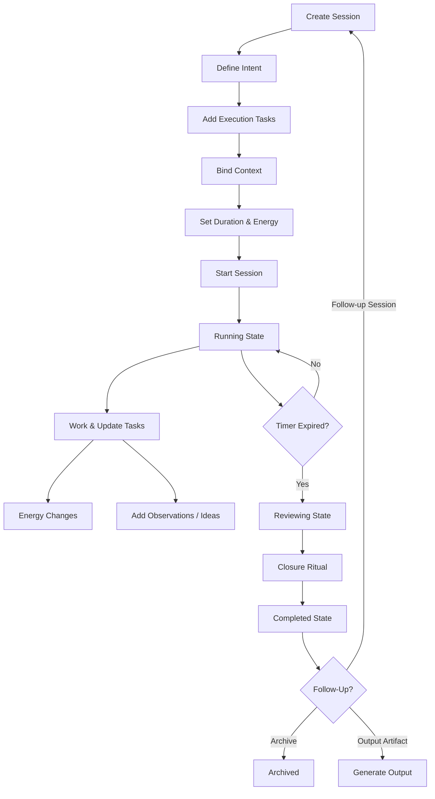
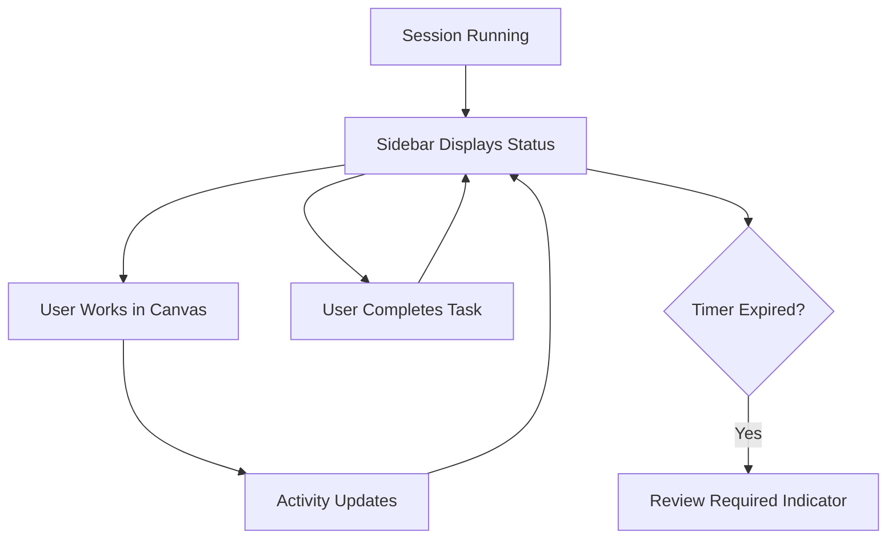

# Run Intentional Session

## Overview

Session v2 transforms the session lifecycle into an **intent-driven execution environment**. Users define a clear outcome before starting, execute against a structured task checklist, track energy levels, capture structured reflections (observations, blockers, ideas, decisions), and complete a mandatory closure ritual when the session ends. The session follows a 6-state lifecycle: prepared → running → paused → reviewing → completed → archived.

This flow covers two primary usage modes:
- **Deep Work Mode** — individual focused work with execution tracking
- **Workshop Mode** — facilitator-driven sessions with agenda items and live decision capture

Both modes share the same lifecycle but differ in UI emphasis and guiding behaviour.

## Personas

| Persona | Mode | Primary JTBD |
|---------|------|-------------|
| Domain Architect | Deep Work | Focused Work, Traceability |
| Engineer | Deep Work | Focused Work, Resume |
| Product Owner | Deep Work / Planning | Capture Outcomes, Execution |
| Workshop Facilitator | Workshop | Agenda Tracking, Decision Capture |

## Trigger

User clicks "New Session" in the Session Workspace view, runs the `flowti:create-session` command, or uses a saved template. The flow begins in the `prepared` state — sessions no longer jump directly to `running`.

## Steps

### Phase 1 — Preparation

#### 1. Create Session

- **View/Service**: SessionWorkspaceView → SessionService
- **User Action**: User clicks "New Session", enters a title, selects a session type
- **System Response**: SessionService creates a new Session with status `"prepared"`, generates a unique ID, initializes empty arrays for execution tasks, reflections, activity, context bindings. The workspace renders the preparation view
- **Events**: `session.create` → `session.created`

#### 2. Define Intent (Required)

- **View/Service**: SessionMainView (IntentCard)
- **User Action**: User enters **Primary Outcome** (required text), optionally adds **Why This Matters**, and selects a **Session Mode** (Deep Work, Planning, Workshop, Review, Exploration)
- **System Response**: SessionService validates the intent and stores it on the session entity. The Start button remains disabled until Primary Outcome is defined. In Workshop mode, the ExecutionCard label changes to "Agenda"
- **Events**: `session.intent.set` → `session.mode.set`
- **Constraint**: Start is disabled until Primary Outcome is defined

#### 3. Add Execution Tasks

- **View/Service**: SessionMainView (ExecutionCard)
- **User Action**: User adds 3–5 tasks describing what they intend to accomplish. Tasks can be reordered via drag-and-drop. In Workshop mode, these are agenda items
- **System Response**: Each task is created with `{ id, label, completed: false, order }`. A recommended maximum of 5 tasks is enforced via soft warning (not hard limit). Progress indicator shows `0 / N`
- **Events**: `session.task.added` (per task)
- **Decision Point**: Workshop mode tasks may include duration per agenda item (FR-18)

#### 4. Bind Context

- **View/Service**: SessionMainView (ContextIntelligenceCard)
- **User Action**: User binds relevant vault entities — PRDs, canvases, notes, folders, domains, features, products
- **System Response**: Context bindings are persisted with the session. The session becomes a micro execution hub connected to the knowledge graph. Max 10 bindings per session
- **Events**: `session.context.bind` → `session.context.bound` (per binding)

#### 5. Set Duration and Energy

- **View/Service**: SessionMainView (TimerEnergyCard)
- **User Action**: User sets timer duration (e.g., 25, 45, 60 minutes or open-ended) and initial energy level (1–5 scale)
- **System Response**: Duration and energy persisted on session entity. Energy level is visible in both Main and Sidebar modes
- **Events**: `session.energy.changed`

**Emotional State**: Intentional, organized. The user knows exactly what they're doing and why.

---

### Phase 2 — Execution

#### 6. Start Session

- **View/Service**: SessionMainView → SessionService
- **User Action**: User clicks "Start"
- **System Response**: SessionService validates that Primary Outcome is defined, transitions session from `prepared` → `running`, records `startedAt` timestamp, starts countdown timer, begins activity tracking. Workspace switches to the execution view with all cards active
- **Events**: `session.start` → `session.started`
- **State Transition**: `prepared` → `running`

#### 7. Execute Work

- **View/Service**: SessionMainView / SessionSidebarView
- **User Action**: User works in Canvas, code, or notes. Checks off execution tasks as completed. Adds observations, ideas, or decisions as they arise. Adjusts energy level as it changes
- **System Response**:
  - **Activity tracking**: File events (create, modify, delete, rename) are logged in the activity timeline
  - **Task completion**: Progress indicator updates (`completedTasks / totalTasks`). Task completion emits events
  - **Reflections**: Observations, blockers, ideas, and decisions are captured as structured `ReflectionEntry` records with timestamp
  - **Energy changes**: Energy level updates emit events and are visible in both modes. Energy drops can trigger cognitive overload detection
  - In **Workshop mode**: Decision entries are visually highlighted, event timeline is auto-expanded in Sidebar
- **Events**: `session.activity.tracked`, `session.task.completed`, `session.reflection.added`, `session.energy.changed`

#### 8. Pause and Resume (Optional)

- **View/Service**: SessionMainView → SessionService
- **User Action**: User clicks "Pause" to temporarily stop
- **System Response**: Session transitions `running` → `paused`. Timer stops. Workspace state is saved (open files, active file). Intent becomes editable again. On resume: session transitions `paused` → `running`, workspace state restored, timer resumes
- **Events**:
  - Pause: `session.pause` → `session.paused` → `session.state.save` → `session.state.saved`
  - Resume: `session.resume` → `session.resumed` → `session.state.restore` → `session.state.restored`
- **State Transitions**: `running` → `paused` → `running`

---

### Phase 3 — Overload Detection (Conditional)

#### 9. Cognitive Overload Warning

- **Trigger**: System detects threshold exceedance:
  - More than 5 execution tasks (configurable)
  - More than 8 context bindings (configurable)
  - Session duration exceeds threshold (configurable)
  - Low energy (≤2) combined with high task count
- **System Response**: Non-blocking `CognitiveLoadAlert` rendered between ExecutionCard and ContextCard. Warning includes overload reasons and suggestion text. Warning is dismissible
- **User Action**: User may remove tasks, unbind context, split session into a follow-up, or dismiss and continue
- **Events**: `session.overload.detected`

---

### Phase 4 — Completion & Closure

#### 10. Timer Expiry → Reviewing State

- **Trigger**: Timer reaches zero, or user manually clicks "Complete"
- **System Response**: Session transitions from `running` → `reviewing` (NOT directly to `completed`). The `SessionReviewOverlay` appears, blocking the main workspace content. Sidebar shows "Review Required" status badge. The overlay presents the closure ritual
- **Events**: `session.review.started`
- **State Transition**: `running` → `reviewing`

#### 11. Closure Ritual

- **View/Service**: SessionReviewOverlay → SessionService
- **User Action**: User answers structured closure questions:
  - **Outcome achieved?** — Yes / Partial / No (required)
  - **What worked?** — free text (required)
  - **What didn't?** — free text (required)
  - **Next action?** — free text (required)
  - Additional configurable questions from closure template
- **System Response**: Closure response is validated (all required fields must be completed). The "Complete Session" button is disabled until required fields are answered. Closure template follows 3-tier inheritance: Global defaults → Session Type override → Instance override
- **Events**: `session.closure.started` → `session.closure.completed`
- **Constraint**: Session cannot transition from `reviewing` → `completed` without completed closure ritual

#### 12. Session Completed

- **System Response**: Session transitions `reviewing` → `completed`. Summary generated with goals, decisions, reflections, activity, closure response. Summary written to markdown file. Workspace shows read-only completed state with output artifacts panel
- **Events**: `session.complete` → `session.completed`
- **State Transition**: `reviewing` → `completed`

**Emotional State**: Closure, clarity. The user knows what they achieved and what comes next.

---

### Phase 5 — Aftermath

#### 13. Follow-Up Actions

- **View/Service**: SessionMainView (post-completion)
- **User Action**: User selects one of:
  - **Create follow-up session** — new session inheriting intent and context bindings (modified outcome)
  - **Create backlog item** — placeholder for future backlog integration
  - **Generate output artifact** — meeting invite, action items, review summary, or custom template
  - **Archive session** — move to archive
- **System Response**: Follow-up session carries forward the original's primary outcome and context. Output artifacts are generated using existing template system (10 mustache placeholders). Archived sessions remain accessible
- **Events**: `session.archive` → `session.archived` (if archiving), `session.output.generate` → `session.output.generated` (if generating output)
- **State Transition**: `completed` → `archived` (if archiving)

---

## Workshop Mode Variant

When the user selects `session.mode === "workshop"` during preparation:

| Aspect | Deep Work | Workshop |
|--------|-----------|----------|
| ExecutionCard label | "Execution Tasks" | "Agenda" |
| Task items | Simple checklist | May include duration per item |
| Decision entries | Standard | Visually highlighted |
| Event timeline (Sidebar) | Collapsed | Auto-expanded |
| Guiding questions | Type-specific | Workshop-specific |
| Layout | Standard | Facilitator-optimized (screen-share friendly) |

Workshop flow follows the same 5 phases. The facilitator uses the Sidebar in a shared-screen context while Canvas is displayed in the main view.

---

## State-Based Flow Model

```
prepared
   ↓ Start (requires intent)
running
   ↓ Pause          ↓ Timer Expiry / Manual Complete
paused           reviewing
   ↓ Resume           ↓ Complete Closure Ritual
running          completed
                     ↓ Archive
                 archived
```

### Valid State Transitions

| From | To | Trigger |
|------|----|---------|
| prepared | running | User clicks Start (intent required) |
| running | paused | User clicks Pause |
| paused | running | User clicks Resume |
| running | reviewing | Timer reaches zero / User clicks Complete |
| reviewing | completed | Closure ritual completed |
| completed | archived | User clicks Archive |

**Invalid transitions are rejected** by the state machine (e.g., `prepared` → `completed`, `running` → `completed`).

---

## Edge & Failure Flows

### Edge 1 — App Close Mid-Session

On reload:
- If session state is `running`: restore session, user can resume or mark as interrupted
- Workspace state (open files, active file) is restored from last persisted snapshot
- Timer resumes from remaining duration

### Edge 2 — User Ignores Review

System enforces:
- No transition from `reviewing` → `completed` without closure ritual completion
- "Complete" button is disabled until all required fields are answered
- Session remains in `reviewing` state until ritual is completed

### Edge 3 — Starting Without Outcome

System prevents:
- "Start" button is disabled until Primary Outcome is defined
- Intent validation occurs in `handleStartSession()`

### Edge 4 — Session Without Timer (Open-Ended)

- Duration = 0: no timer countdown, no auto-transition to `reviewing`
- User must manually click "Complete" to enter `reviewing` state
- All other phases (intent, execution, closure) apply identically

---

## Decision Points

| Decision | Options | Default |
|----------|---------|---------|
| Session mode | Deep Work, Planning, Workshop, Review, Exploration | Deep Work |
| Session type | 8 built-in + custom | vault-hygiene |
| Duration | 0 (open-ended) / 15 / 25 / 30 / 45 / 60 / custom | 25 |
| Energy level | 1–5 scale | 3 |
| Max execution tasks | Soft warning at 5 (configurable) | 5 |
| Closure template | Global default / Session Type override / Instance override | Global default |
| Completion trigger | Timer auto-transition / Manual complete | Timer auto-transition |
| Follow-up action | Follow-up session / Backlog item / Output artifact / Archive | — (user selects) |

## Events Sequence

```
[Create] → session.create → session.created
    → [Define Intent] → session.intent.set → session.mode.set
    → [Add Tasks] → session.task.added (repeated)
    → [Bind Context] → session.context.bind → session.context.bound (repeated)
    → [Set Energy] → session.energy.changed
    → [Start] → session.start → session.started
        → [Work] → session.activity.tracked (repeated)
        → [Complete Tasks] → session.task.completed (repeated)
        → [Add Reflections] → session.reflection.added (repeated)
        → [Change Energy] → session.energy.changed
        → [Overload?] → session.overload.detected (conditional)
        → [Pause] → session.pause → session.paused
            → session.state.save → session.state.saved
        → [Resume] → session.resume → session.resumed
            → session.state.restore → session.state.restored
    → [Timer Expiry] → session.review.started
        → [Closure] → session.closure.started → session.closure.completed
    → [Complete] → session.complete → session.completed
    → [Archive] → session.archive → session.archived
```

## Interaction Diagrams

### Deep Work Flow



### Sidebar Monitoring Flow



## Interaction Philosophy

This flow enforces five principles:

1. **Intent before execution** — outcome must be defined before starting
2. **Measurable execution** — task checklist with progress tracking
3. **Continuous awareness** — energy tracking + cognitive load detection
4. **Mandatory reflection** — structured closure ritual with required fields
5. **Explicit closure** — no silent completion; reviewing state gates completion

## Related Decisions

- [[ADR-026 Composable Folder Filtering]] — activity filtering during execution
- [[ADR-029 ISO Date Prefix for Session Files]] — session file naming
- ADR-031 (planned) — Session v2 Architecture (state machine, dual rendering, closure system)

## Related

- [[Create and Manage Sessions]] — v1 session flow (foundation)
- [[Monitor Session from Sidebar]] — v2 sidebar companion flow
- [[Session Workspaces PRD]] (FR-09 through FR-18)
- [[PBI-SW-010 Session Lifecycle v2 and Intent Layer]]
- [[PBI-SW-012 Execution Plan]]
- [[PBI-SW-013 Structured Reflection]]
- [[PBI-SW-014 Closure Ritual System]]
- [[PBI-SW-016 Cognitive Overload Detection]]
- [[PBI-SW-017 Main Sidebar Mode Separation]]
